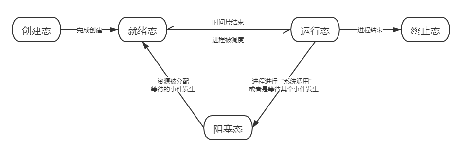
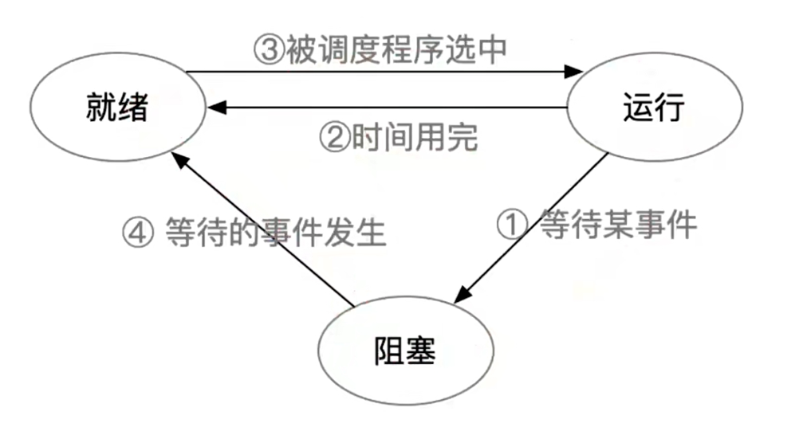
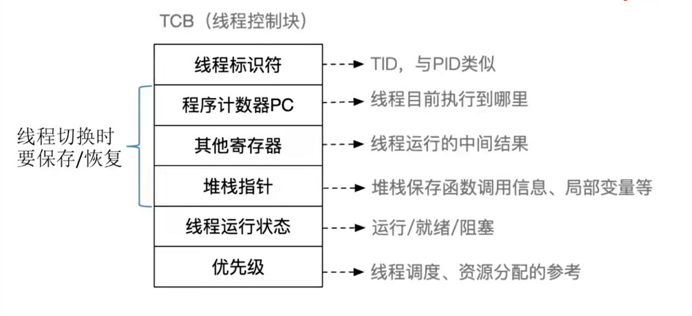

# 2.1 进程与线程

## 2.1.1 进程的概念、组成和特征

### 一、进程的概念


进程是进程实体的**运行过程**，是系统进行**资源分配**和**调度**的一个独立单位。


### 二、进程的组成


一个进程实体（进程映像）由**PCB**、**程序段**、**数据段**组成。

进程是**动态**的，进程实体是**静态**的。进程实体反映了进程在某一时刻的状态。


#### 1、PCB

数据结构**PCB** \( Process Control Block\)，即**进程控制块**。操作系统需要对各个并发运行的进程进行管理，但凡管理时所需要的信息，都会被放在PCB中。


**PCB是进程唯一的标识！**


PCB中存储了包括PID，UID（进程所属用户ID），进程运行情况等相关信息

当进程结束后，系统会回收PCB。

#### 2、程序段和数据段

程序段：程序所包含的指令

数据段：程序产生的数据（如各种变量）

### 三、进程的特征

#### 1、动态性

进程是程序的一次执行过程，是动态地产生、变化和消亡的。

**动态性是进程最基本的特征。**

#### 2、并发性

内存中有多个进程实体，各进程可并发执行

#### 3、独立性

进程是能**独立运行**、**独立获得资源**、**独立接受调度**的基本单位。

#### 4、异步性

各进程按各自独立的、不可预知的速度向前推进， 操作系统要提供“**进程同步机制**”来解决异步问题。

#### 5、结构性

每个进程都会配置一个PCB。结构上看，进程由程序段、数据段、PCB组成。

## 2.1.2 进程的状态与转换

### 一、进程的状态

#### 1、创建态

进程正在被创建。包括建立空白PCB，由系统为进程分配资源等。

#### 2、就绪态

进程获得了**除了处理机外的一切资源**。一旦获得了处理机资源就可以立刻开始运行，系统中处于就绪态的进程可以有**很多个**，通常将它们排成一个队列，称为**就绪队列**。

#### 3、运行态

进程正在处理机上运行。单处理机情况下每个时刻最多只有一个进程在运行态。

#### 4、阻塞态（等待态）

进程请求等待某个事件发生，在该事件完成前，即使处理机资源空闲，该进程也不能运行。例如请求了系统调用或者是等待某些资源。

#### 5、中止态

进程正在结束。系统先将进程置为结束态，之后再进行资源的释放和回收等工作。


如果是多核CPU，可以存在多个运行态的进程



运行态、阻塞态和就绪态是进程的三种基本状态


### 二、进程状态的转换

* 两个不能
  * 不能直接由阻塞态到运行态
  * 不能直接由就绪态到阻塞态
* 转变模式
  * 运行态到阻塞态一般是**主动的**行为
  * 阻塞态到就绪态是**被动的**行为

### 三、进程的组织方式

链式方式：将同一状态的PCB连接到同一个队列中；

索引方式：将同一状态的PCB放在一个索引表当中。

## 2.1.3 进程控制

进程控制是使用**原语**来实现的。


原语是指执行期间**不允许中断**的程序段，是一个不可分割的基本单位。

通过“**关中断**指令”和“**开中断**指令”实现了原语的**原子性**。


### 一、进程的创建

#### 创建原语

1. 申请空白PCB
2. 为进程分配所需资源
3. 初始化PCB
4. 将PCB插入就绪队列（**创建态→就绪态**）

####  引起进程创建的事件

* 用户登录
* 作业调度（_有新的作业将要运行_）
* 提供服务
* 应用请求（_用户进程主动请求创建子进程_）

### 二、进程的终止

#### 撤消原语

1. 从PCB集合中找到终止进程的PCB
2. 若进程正在运行，立刻剥夺CPU，将CPU分配给其他进程
3. 中止其所有子进程
4. 将该进程所有资源归还给父进程或是操作系统
5. 删除PCB

#### 引起进程中止的事件

* 正常结束
* 异常结束
* 外界干预

### 三、进程的阻塞和唤醒


阻塞原语和唤醒原语必须成对使用


#### 阻塞原语

1. 找到要阻塞进程对应的PCB
2. 保护进程运行现场，将进程设置为**阻塞态**，暂时停止进程运行
3. 将PCB插入对应事件的等待队列

#### 引发阻塞的事件

* 需要等待系统分配某种资源
* 需要等待合作的其他进程完成工作

#### 唤醒原语

1. 在事件队列中找到对应的PCB
2. 将PCB从等待队列移除，设置为**就绪态**
3. 将PCB插入就绪队列，等待被唤醒

#### 引发唤醒的事件

* 等待的事件发生

### 四、进程的切换

#### 切换原语

1. 将运行环境信息存入PCB
2. PCB移入相应队列
3. 选择另一个进程执行，并更新其PCB
4. 根据PCB回复进程所需的运行环境

_运行环境_：进程运行中的临时变量等

#### 引起切换的事件

* 当前进程时间片到
* 更高优先级的进程到达
* 当前进程主动阻塞
* 当前进程中止

## 2.1.4 进程通信

### 一、共享存储

* 两个进程对共享空间的访问必须是**互斥**的。
* 操作系统只提供**共享空间**和**同步互斥工具**（如P，V操作）。

两种方式：基于数据结构的共享、基于存储区的共享

#### 基于数据结构的共享

* 只能共享**固定的**数据结构
* 速度慢，是一种低级的共享方式

#### 基于存储区的共享

* 共享方式和大小由进程自己决定
* 速度快，是一种高级的共享方式

### 二、管道通信


管道实际上是一个固定大小的缓冲区


* 管道通信只能实现**半双工通信**，想实现双向通信需要两个管道
* 各个进程对管道的访问也需要是互斥的
* 管道中没有写满（读空）时，**不能**向管道中再写（读）数据
* 从管道中读取数据是**一次性的**，数据一旦被读取就会从管道中抛弃
  * 一次只能有一个读进程
  * 但是可以有多个写进程

### 三、消息传递


进程间的数据交换以格式化消息（message）为单位。

通过**发送消息/接收消息**两个**原语**进行数据交换


两种方式：直接通信方式、间接通信方式

#### 直接通信方式

发送进程直接将消息发送到接收进程的消息缓冲队列中

#### 间接通信方式

发送进程将消息发送到某个中间实体，一般称为_信箱_，接收端从中间实体接收消息

## 2.1.5 线程的概念和特点

### 一、线程的概念

线程是程序执行的最小单元，是进程中的一个实体，是系统独立调度与分派的基本单位。


线程是程序执行的最小单元，是调度的基本单位

进程是资源分配的最小单元


### 二、线程的特点

- **调度**：线程作为独立调度的基本单位，进程内的线程调度不会引起进程切换，开销变小
- **并发性**：更好
  - 进程之间可以并发运行
  - 同一进程内的线程可以并发运行
  - 不同进程间的线程可以并发执行

- **占有资源**：线程几乎不占有资源
- **独立性**
  - 进程拥有独立的地址空间和资源
  - 同一进程内的线程共享地址空间和资源

- **系统开销**：当进行进程内线程的切换时，开销远小于进程
- **支持多处理机系统**：可以将多个线程分配给多个处理机运行

### 三、线程的实现方式

#### 线程库支持的线程（用户级线程 User-Level Thread, ULT\)

* 线程切换由**应用程序**负责，在**用户态**下即可完成
* 线程表存储在用户空间，系统内核意识不到线程的存在
* **调度**
  * 操作系统为进程分配时间片
  * 用户的调度程序再讲时间片分给线程

* 优点
  * 线程的切换在用户态即可完成，**开销小、效率高**
* 缺点
  * 当一个线程被阻塞后，其他线程都会被阻塞，**并发度不高**

#### 内核支持的线程（内核级线程 Kernel-Level Thread）

* 内核级线程的管理工作由**操作系统内核**完成
* 内核的切换需要在**内核态**下实现
* 线程表存储在内核空间，内核态线程是操作系统内核能够看到的
* **调度**
  * 操作系统以线程为调度单位

* 优点
  * 一个线程被阻塞后，其他线程继续运行，**并发性强**
* 缺点
  * 线程的切换需要内核态，**成本高、开销大**

### 四、多线程模型

#### 1、一对一模式

一个用户级线程映射一个内核级线程

* 并发能力强
* 开销大

#### 2、多对一模式

将多个用户级线程映射到一个内核级线程，等同于用户级线程

* 效率高
* 并发能力弱；多个线程不能并行的运行在多处理机上

#### 3、多对多模式

将n个用户级线程映射到m个内核级线程上（m &lt;= n）

## 2.1.6 线程的控制

### 一、线程的状态转换

### 二、线程的组织与控制

将TCB组织成线程表进行管理

