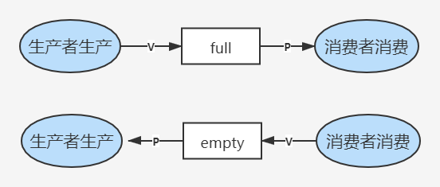
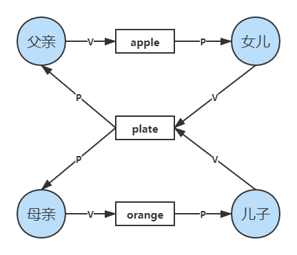
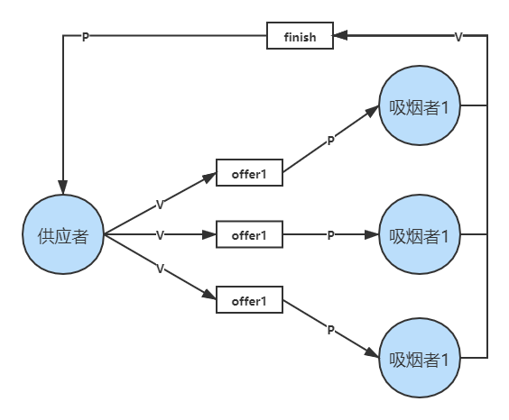

# 2.3 进程管理（经典进程同步问题）


互斥：

* P
* 临界资源
* V

同步：

* 前置事件
* V
* -----------------------
* P
* 后置事件


## 一、生产者-消费者问题

* 系统中有一组生产者进程和一组消费者进程，生产者进程每次生产一个产品放入缓冲区，消费者进程每次从缓冲区中取出一个产品并使用；
* 生产者、消费者共享一个初始为空、大小为n的缓冲区；
* 只有缓冲区**没满**时，生产者才能把产品**放入**缓冲区，否则必须等待；
* 只有缓冲区**不空**时，消费者才能从中**取出**产品，否则必须等待；
* 缓冲区是临界资源，各进程必须**互斥地**访问。

### 1、分析关系

* 生产者和消费者访问缓冲区是**互斥**的；
* 生产者和消费者的工作需要**同步**，即生产完成之后才能消费。



### 2、设置信号量

```c
semaphore mutex = 1;    //互斥信号量，实现对缓冲区的互斥访问
semaphore empty = n;    //同步信号量，表示空闲缓冲区的数量
semaphore full = 0;     //同步信号量，表示产品（非空缓冲区）的数量
```

### 3、实际代码

```c
producer(){
    while(1){
        生产产品
        P(empty);    //申请新的缓冲区
        P(mutex);    //申请访问临界资源
        存入缓冲区
        V(mutex);    //释放临界资源
        V(full);     //释放一个消费品（非空缓冲区）
    }
}

consumer(){
    while(1){
        P(full);     //申请使用消费品
        P(mutex);    //申请访问临界资源
        从缓冲区取出
        V(mutex);    //释放临界资源
        V(empty);    //释放一个空缓冲区
        消费产品
    }
}
```


实现**互斥**的P操作一定要在实现**同步**的P操作**之后**

两个V操作可以交换顺序



## 二、多生产者-多消费者问题

有父亲、母亲、儿子、女儿四人，其中：

* 父亲往盘子中放苹果；
* 母亲往盘子中放橘子；
* 女儿从盘子中拿苹果；
* 儿子从盘子中拿橘子；
* 只有盘子空时才能放水果；
* 只有有需要的水果时才能拿水果。

### 1、分析关系

* 互斥
  * 对盘子的访问是互斥的
* 同步
  * 父亲放入苹果后，女儿才能拿苹果
  * 母亲放入橘子后，儿子才能拿橘子
  * 盘子为空时才能放水果



### 2、设置信号量

```c
semaphore mutex = 1;    //互斥信号量，实现盘子的互斥访问
semaphore plate = 1;    //同步信号量，代表盘子的剩余空位
semaphore apple = 0;    //同步信号量，代表苹果数量
semaphore orange = 0;   //同步信号量，代表橘子数量
```

### 3、实际代码

```c
dad(){
    while(1){
        准备苹果
        P(plate);        //申请盘子资源
        P(mutex);
        将苹果放入盘子
        V(mutex);
        V(apple);        //释放一个苹果
    }
}

mom(){
    while(1){
        准备橘子
        P(plate);        //申请盘子资源
        P(mutex);
        将橘子放入盘子
        V(mutex);
        V(orange);       //释放一个橘子
    }
}

daughter(){
    while(1){
        P(apple);        //申请苹果资源
        P(mutex);
        拿出苹果
        V(mutex);
        V(plate);        //释放盘子资源
        恰苹果        
    }
}

son(){
    while(1){
        P(orange);       //申请橘子资源
        P(mutex);
        拿出橘子
        V(mutex);
        V(plate);        //释放盘子资源
        恰橘子        
    }
}
```

由于本问题缓冲区为1，可以考虑不设置信号量。


## 三、吸烟者问题

系统中有一个供应者和三个吸烟者，吸烟者吸烟需要自己卷烟，其中

* 卷烟需要烟草、纸、胶水三种材料
* 每个吸烟者各有其中的一种材料
* 供应者每次会提供其中两种材料，并由缺少该材料的吸烟者拿取
* 吸烟者制作完烟并抽掉后，发出信号，供应者放下一组物品

### 1、分析关系

可以将桌子视为容量为1的缓冲区，并且将两种材料分别视为三种组合：

* 组合一：纸+胶水
* 组合二：烟草+胶水
* 组合三：烟草+纸



* 互斥
  * 对桌子的访问需要互斥进行
* 同步
  * 桌上有组合一，第一个抽烟者取走物品
  * 桌上有组合二，第二个抽烟者取走物品
  * 桌上有组合三，第三个抽烟者取走物品
  * 发出完成信号后，供应者将下一个组合放到桌上

### 2、信号量设置

```c
semaphore offer1 = 0;    //同步信号量，桌上组合一的数量
semaphore offer1 = 0;    //同步信号量，桌上组合二的数量
semaphore offer1 = 0;    //同步信号量，桌上组合三的数量
semaphore finish = 0;    //同步信号量，抽烟是否完成
int i = 0;               //实现轮流提供材料
```

### 3、实际代码

```c
provider(){
    while(1){
        if (i==0){
            将组合一放在桌上
            V(offer1);        //提供材料
        }else if (i==1){
            将组合二放在桌上
            V(offer2);
        }else if (i ==2){
            将组合三放在桌上
            V(offer3);
        }
        i = (i+1) % 3;       //轮流提供素材
        P(finish);           //等待完成信号
    }
}

smoker1(){
    while(1){
        P(offer1);           //请求组合一资源
        从桌上拿走组合一
        卷烟，抽烟
        V(finish);           //发出完成信号
    }
}

smoker2(){
    while(1){
        P(offer2);
        从桌上拿走组合二
        卷烟，抽烟
        V(finish);
    }
}

smoker3(){
    while(1){
        P(offer3);
        从桌上拿走组合三
        卷烟，抽烟
        V(finish);
    }
}
```


## 四、读者-写者问题

有读者和写者两组并发进程，共享一个文件。要求：

* 读者可以同时读取文件；
* 同一时间只能有一个写者进行写操作；
* 任一写着完成写操作之前不允许其他进程进行读或写操作；
* 写者执行写操作前，应让其他读者和写者全部退出。

### 1、关系分析

* 互斥
  * 写进程和写进程之间
  * 写进程和读进程之间

### 2、信号量设置

```c
semaphore rw = 1;        //互斥信号量，实现读、写对文件的互斥访问
int count = 0;           //同时在读文件的读进程数量
semaphore mutex = 1;     //互斥信号量，实现读进程对count的互斥访问
```

然而，以上信号量设置有可能导致**饿死**，具体如下代码一所示，因此，增加一个信号量

```c
semaphore w = 1;          //同步信号量，用于实现“写优先”
```

### 3、实际代码

```c
writer(){
    while(1){
        P(rw);
        写文件
        V(rw);
    }
}

reader(){
    while(1){
        P(mutex);
        if (count == 0){
            P(rw);        //由第一个读进程负责上锁
        }
        V(mutex);
        
        读文件
        
        P(mutex);
        count--;
        if (count == 0){
            V(rw);        //由最后一个读进程负责解锁
        }
        V(mutex);
    }
}
```

以上代码存在饿死现象，即一直有读进程占用，写进程始终无法运行

因此，引入了“写优先”的信号量：

```c
writer(){
    while(1){
        P(w);
        P(rw);
        写文件
        V(rw);
        V(w);
    }
}

reader(){
    while(1){
        P(w);             //对每一个读和写进程之间做互斥处理
        P(mutex);
        if (count == 0){
            P(rw);        //由第一个读进程负责上锁
        }
        V(mutex);
        V(w);
        
        读文件
        
        P(mutex);
        count--;
        if (count == 0){
            V(rw);        //由最后一个读进程负责解锁
        }
        V(mutex);
    }
}
```

当然，这种实际上是各个读、写进程之间公平运行，并不是准确的写优先。


## 五、哲学家进餐问题

在一个桌子上，有5位哲学家，其中

* 每位哲学家之间摆着一**根**筷子，共计5根
* 


