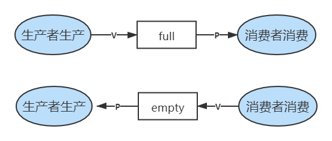

# 2.3 进程管理（经典进程同步问题）


互斥：

* P
* 临界资源
* V

同步：

* 前置事件
* V
* -----------------------
* P
* 后置事件


## 一、生产者-消费者问题

* 系统中有一组生产者进程和一组消费者进程，生产者进程每次生产一个产品放入缓冲区，消费者进程每次从缓冲区中取出一个产品并使用；
* 生产者、消费者共享一个初始为空、大小为n的缓冲区；
* 只有缓冲区**没满**时，生产者才能把产品**放入**缓冲区，否则必须等待；
* 只有缓冲区**不空**时，消费者才能从中**取出**产品，否则必须等待；
* 缓冲区是临界资源，各进程必须**互斥地**访问。

### 1、分析关系

* 生产者和消费者访问缓冲区是**互斥**的；
* 生产者和消费者的工作需要**同步**，即生产完成之后才能消费。



### 2、设置信号量

```c
semaphore mutex = 1;    //互斥信号量，实现对缓冲区的互斥访问
semaphore empty = n;    //同步信号量，表示空闲缓冲区的数量
semaphore full = 0;     //同步信号量，表示产品（非空缓冲区）的数量
```

### 3、实际代码

```c
producer(){
    while(1){
        生产产品
        P(empty);    //申请新的缓冲区
        P(mutex);    //申请访问临界资源
        存入缓冲区
        V(mutex);    //释放临界资源
        V(full);     //释放一个消费品（非空缓冲区）
    }
}

consumer(){
    while(1){
        P(full);     //申请使用消费品
        P(mutex);    //申请访问临界资源
        从缓冲区取出
        V(mutex);    //释放临界资源
        V(empty);    //释放一个空缓冲区
        消费产品
    }
}
```


实现**互斥**的P操作一定要在实现**同步**的P操作**之后**

两个V操作可以交换顺序



## 二、多生产者-多消费者问题

有父亲、母亲、儿子、女儿四人，其中：

* 父亲往盘子中放苹果；
* 母亲往盘子中放橘子；
* 女儿从盘子中拿苹果；
* 儿子从盘子中拿橘子；
* 只有盘子空时才能放水果；
* 只有有需要的水果时才能拿水果。

### 1、分析关系

* 互斥
  * 对盘子的访问是互斥的
* 同步
  * 父亲放入苹果后，女儿才能拿苹果
  * 母亲放入橘子后，儿子才能拿橘子
  * 盘子为空时才能放水果


### 2、设置信号量

```c
semaphore mutex = 1;    //互斥信号量，实现盘子的互斥访问
semaphore plate = 1;    //同步信号量，代表盘子的剩余空位
semaphore apple = 0;    //同步信号量，代表苹果数量
semaphore orange = 0;   //同步信号量，代表橘子数量
```

### 3、实际代码

```c
dad(){
    while(1){
        准备苹果
        P(plate);        //申请盘子资源
        P(mutex);
        将苹果放入盘子
        V(mutex);
        V(apple);        //释放一个苹果
    }
}

mom(){
    while(1){
        准备橘子
        P(plate);        //申请盘子资源
        P(mutex);
        将橘子放入盘子
        V(mutex);
        V(orange);       //释放一个橘子
    }
}

daughter(){
    while(1){
        P(apple);        //申请苹果资源
        P(mutex);
        拿出苹果
        V(mutex);
        V(plate);        //释放盘子资源
        恰苹果        
    }
}

son(){
    while(1){
        P(orange);       //申请橘子资源
        P(mutex);
        拿出橘子
        V(mutex);
        V(plate);        //释放盘子资源
        恰橘子        
    }
}
```

由于本问题缓冲区为1，可以考虑不设置信号量。


## 三、读者-作者问题

