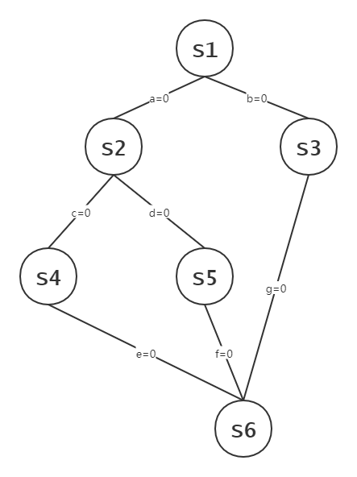

# 2.3 进程同步

## 2.3.1 进程同步的概念

### 一、临界资源

临界资源指一个时间段内只允许一个进程使用的资源。

例如物理设备、内存缓冲区等都是临界资源。

在每个进程中，访问临界资源的那部分代码被称为**临界区**。对临界资源的访问，可以分为四个阶段：

```objectivec
do {
    entry section;      //进入区
    critical section;   //临界区
    exit section;       //退出区
    remainder section;  //剩余区
} while (true)
```

1. **进入区**：检查是否可以进入临界区，若可以进入，则设置**正在访问临界资源的标志**，以阻止其他进程进入临界区；
2. **临界区（临界段）**：进程中访问临界区的一段代码；
3. **退出区**：将正在访问临界资源的标志**解除**；
4. 剩余区：代码中的其他部分。

进入区和退出区负责实现**互斥**。

### 二、同步

**同步**亦称**直接制约关系**，它是指为完成某种任务而建立的两个或多个进程，这些进程因为需要在某些位置上协调它们的工作次序而产生的制约关系。进程间的直接制约关系就是源于它们之间的相互合作。

### 三、互斥

对**临界资源**的访问，必须**互斥**地进行。

**互斥**，亦称**间接制约关系**。进程互斥指当一个进程访问某临界资源时，另一个想要访问该临界资源的进程必须等待。当前访问临界资源的进程访问结束，释放该资源之后, 另一个进程才能去访问临界资源。

#### 互斥的原则

1. 空闲让进：临界区空闲时，可以允许一个请求进入临界区的进程立即进入临界区；
2. 忙则等待：当已有进程进入临界区时，其他试图进入临界区的进程必须等待；
3. 有限等待：对请求访问的进程，应保证能在有限时间内进入临界区（保证不会饥饿）；
4. 让权等待：当进程不能进入临界区时，应立即释放处理机，防止进程忙等待。

## 2.3.2 临界区互斥的实现

### 一、软件实现

#### 1、单标志法

一个进程在访问完临界区后会把使用临界区资源的权限转交给另一个进程，即每个进程进入临界区的权限只能由另一个进程赋予

```cpp
int turn=0;         //公用变量，表示当前允许进入临界区的进程号

// P0进程
while (turn != 0);  //进入区
critical section;   //临界区
turn = 1;           //退出区
remainder section;  //剩余区

// P1进程
while (turn != 1);  //进入区
critical section;   //临界区
turn = 0;           //退出区
remainder section;  //剩余区
```

该算法可以实现同一时刻只允许一个进程进入临界区。

但是两个程序必须轮流进入临界区，若1不再进入临界区，则0将无法再次进入临界区，**违背了“空闲让进”原则**。

#### 2、双标志先检查法

设置一个数组，相应元素表示进程访问临界资源的意愿。

```cpp
bool flag[2];       //表示进入临界区意愿
flag[0] = false;
flag[1] = false;

//P0进程
while (flag[1]);    //若P1希望进入临界区，则P0循环等待
flag[0] = true;     //标记P0希望进入临界区
critical section;   //访问临界区
flag[0] = false;    //标记P0不再希望使用临界区
remainder section;

//P1进程
while (flag[0]);    //若P0希望进入临界区，则P1循环等待
flag[1] = true;     //标记P1希望进入临界区
critical section;   //访问临界区
flag[1] = false;    //标记P1不再希望使用临界区
remainder section;
```

此算法不需要轮流进入临界区，可以连续访问临界资源。

在检查对方意愿和切换自己意愿之间有时间差，可能出现同时访问临界区，**违反了“忙则等待”原则**。

#### 3、双标志后检查法

相比于双标志先检查法，此算法先修改自身意愿，再进行检查。

```cpp
bool flag[2];       //表示进入临界区意愿
flag[0] = false;
flag[1] = false;

//P0进程
flag[0] = true;     //标记P0希望进入临界区
while (flag[1]);    //若P1希望进入临界区，则P0循环等待
critical section;   //访问临界区
flag[0] = false;    //标记P0不再希望使用临界区
remainder section;

//P1进程
flag[1] = true;     //标记P1希望进入临界区
while (flag[0]);    //若P0希望进入临界区，则P1循环等待
critical section;   //访问临界区
flag[1] = false;    //标记P1不再希望使用临界区
remainder section;
```

这一算法解决了“忙则等待”的问题，但是若两个进程同时标记为true，又会相互等待造成**饥饿**，**违背了“空闲让进”和“有限等待”原则**。

#### 4、Peterson's Algorithm

综合了单标志法和双标志后检查法。

```cpp
//P0进程
flag[0] = true;              //标记P0希望进入临界区
turn = 1;                    

while (flag[1]&&turn==1);    //若P1希望进入临界区，则P0循环等待
critical section;            //访问临界区
flag[0] = false;             //标记P0不再希望使用临界区
remainder section;

//P1进程
flag[1] = true;              //标记P1希望进入临界区
turn = 0;

while (flag[0]&&turn==0);    //若P0希望进入临界区，则P1循环等待
critical section;            //访问临界区
flag[1] = false;             //标记P1不再希望使用临界区
remainder section;
```

1. 首先设置自身想要访问临界区，并将当前访问权限交给对方。
2. 若此时对方也希望访问临界资源，则自身循环等待。
3. 当自身访问完临界区后，取消访问意愿标记。以便其它进程访问。

* 此算法利用flag\[ \]实现了临界资源的**互斥访问**，并用turn解决了“**饥饿**”现象；
* 遵循了空闲让进、忙则等待和有限等待原则；
* 但是**没有遵循让权等待原则**（需要在CPU上不断循环检测）。

### 二、硬件实现

#### 1、中断屏蔽方法

利用开关中断的方式实现

```cpp
...
关中断 //关中断后不允许当前进程被中断
临界区
开中断
...
```

* 优点
  * 简洁、高效
* 缺点
  * 不适用于多处理机
  * 只适用于操作系统内核进程（开/关中断指令只能执行在内核态）

#### 2、TestAndSet指令

简称TS指令，或TSL（TestAndSetLock）指令。

TSL指令是用**硬件实现的**，执行的过程不允许被中断。以下是其C语言逻辑：

```cpp
bool lock;                        //共享变量表示临界资源是否上锁

bool TestAndSet(bool *lock){
    bool old;
    old = *lock;
    *lock = true;                //无论之前是否上锁，将lock设置为true
    return old;                  //返回之前lock的值
}

while (TestAndSet (&lock));      //若可以进入临界区，则进入循环
critical section;
lock = false;                    //为临界资源解锁
remainder section;
```

* 优点
  * 实现简单
  * 适用于多处理机环境
* 缺点
  * **不满足让权等待原则**，暂时无法进入临界区的资源仍然会占用CPU并循环执行TS指令，导致“**忙等**”。

#### 3、Swap指令

也称为Exchange指令，或简称XCHG指令。

Swap指令是用**硬件实现的**，执行的过程不允许被中断。以下是其C语言逻辑：

```cpp
bool lock;

Swap(bool *a, bool *b){
    bool temp;
    temp = *a;
    *a = *b;
    *b = temp;
}

bool old = true;                //局部变量，存放之前lock的值
while (old == true){
    Swap(&old, &lock)
}
critical section;
lock = false;                   //解锁临界资源
remainder section;
```

其原理、优缺点实际上都与TS指令相似。

## 2.3 信号量

信号量是一种功能较强的机制，可用于解决互斥与同步的问题。它只能被两个标准原语**wait\(S\)**和**signal\(S\)**访问，也被记作“**P操作**”和“**V操作**”。


在荷兰文中，通过叫passeren，释放叫vrijgeven，PV操作因此得名


### 一、整形信号量

用一个**整数型的变量**作为信号量，用来表示**系统中某种资源的数量**。

与普通整型变量相比，信号量只有三种操作：初始化、P操作、V操作。

```c
int S = 1;                //初始化整型信号量，表示当前系统中可用资源数量

void wait(int S){         //wait原语，相当于进入区
    while (S <= 0);       //若资源不够，则一直等待
    S = S-1;              //若资源够，则占用一个资源
}

void signal(int S){       //signal原语，相当于退出区
    s = S+1;              //释放资源
}
```

由于P操作中资源不够时会一直循环，所以**不满足让权等待，会发生“忙等”**。

### 二、记录型信号量

```c
typedef struct {
    int value;            //剩余资源数
    struct process *L;    //等待队列
} semaphore;
```

在记录型信号量中，除了代表资源数量的value之外，还有一个进程链表L。

```c
void wait (semaphore S){
    S.value--;
    if (S.value < 0){
        block(S.L);        //若资源数量不足，则使用block原语将进程阻塞，并加入等待队列之中
    }
}

void signal (semaphore S){
    S.value++;
    if (S.value <= 0){
        wakeup(S.L);       //若释放资源后可还有进程在等待，则唤醒该进程，使其从阻塞态变为就绪态
    }
}
```

此机制遵循了让权等待原则，不会发生“忙等”。

### 三、用信号量机制实现进程同步、互斥

#### 1、进程互斥

设置互斥信号量mutex，初值为1。

```c
semaphore mutex = 1;        //这里可以直接这么写

P1(){
    ...
    P(mutex);               //申请进入临界区
    critical section;
    V(mutex);               //释放资源
    ...
}

P2(){
    ...
    P(mutex);
    critical section;
    V(mutex);
    ...
}
```

可以理解为此信号量表示进入临界区的名额，并且只有一个。


需要为不同的临界资源设置不同的互斥信号量；

P、V操作必须成对出现。


#### 2、进程同步


进程同步：让各并发进程按照一定顺序进行


设置同步信号量S，初值为0；

```c
semaphore S = 0;

P1(){
    CODE1;
    CODE2;
    V(S);
    CODE3;
}

P2(){
    P(S);
    CODE4;
    CODE5;
    CODE6;
}
```

只有CODE1、2执行完毕，且进行了V操作之后，进程2中的P操作才不会阻塞，并且能够继续执行下去。

### 四、信号量机制实现前驱关系



1. 需要为每一对前驱关系设置一个同步信号量；
2. 在**前操作之后**对相应的同步信号量执行**V操作**；
3. 在**后操作之前**对相应的同步信号量执行**P操作**。

```c
P1(){
    ...
    S1;
    V(a);
    V(b);
    ...
}

P2(){
    ...
    P(a);
    S2;
    V(c);
    V(d);
    ...
}

P3(){
    ...
    P(b);
    S3;
    V(g);
    ...
}

P4(){
    ...
    P(c);
    S4;
    V(e);
    ...
}

P5(){
    ...
    P(d);
    S5;
    V(f);
    ...
}

P6(){
    ...
    P(e);
    P(f);
    P(g);
    S6;
    ...
}
```


