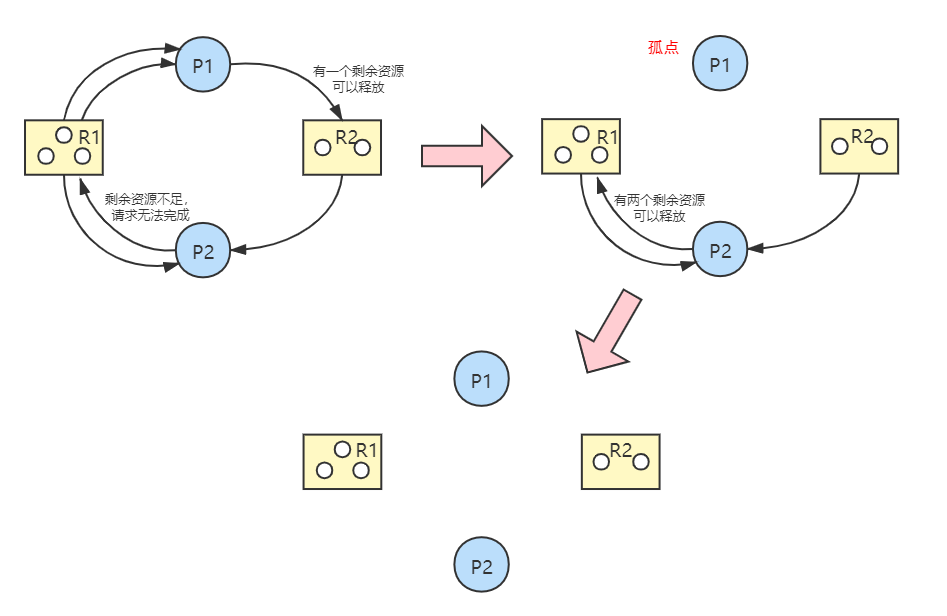

# 2.4 死锁

## 2.4.1 死锁的概念

### 1、死锁的定义

在并发环境下，各进程因竞争资源而造成的一种**相互等待对方手里的资源**，导致这些进程均阻塞。若没有外力干涉，这些进程都无法继续前进。


**死锁**：互相等待对方手里的资源，导致各进程都阻塞，无法前进的现象

**饥饿**：由于长期得不到资源，某进程一直得不到处理机的现象

**死循环**：某进程执行过程中一直跳不出某个循环的现象


### 2、死锁产生的必要条件

死锁的产生，以下四个条件缺一不可：

1. **互斥条件**：只有对互斥资源的争抢才可能导致死锁；
2. **不剥夺条件**：进程所获得的资源在未使用完之前，**不能由其他进程强行夺走**，只能主动释放；
3. **请求和保持条件**：进程**已经占用了至少一个资源**，同时又提出了新的资源请求，而所**请求的资源被其他进程所占用**，此时请求被阻塞，但是该进程**仍然保持已有的资源不放**；
4. **循环等待条件**：存在一种进程循环等待资源的现象，循环中的每一个进程已获得的资源同时被下一个进程所需求。


发生死锁时一定有循环等待，但发生循环等待时未必会死锁。

如果系统中还有其他同类型资源，则不会发生死锁；如果系统中每种资源只有一个，则将会发生死锁。


综上，可以有以下结论：

#### 1、死锁产生的原因

1. 系统资源的竞争
2. 进程推进顺序非法

#### 2、死锁的处理策略

1. 死锁预防
2. 避免死锁
3. 死锁的检测及解除

## 2.4.2 死锁预防

预防死锁的发生只需要**破坏四个必要条件之一**即可。

### 1、破坏互斥条件

把只能互斥访问的资源变为共享资源。例如使用SPOOLing技术使得设备可以逻辑上共享。但是一般不常用。

### 2、破坏不剥夺条件

一、当某个进程请求新的资源而得不到时，立刻释放其已有资源，以待后面再次申请；

二、为进程设置不同的优先级，当某个进程需要的资源被其他进程占用时，可以由操作系统协作将想要的资源强行剥夺。

#### 缺点：

* 实现起来较为复杂；
* 这种方式会造成前一阶段工作的失效，因此仅适用于易保存和恢复的资源，例如CPU；
* 反复申请和释放资源会造成较大的系统开销；
* 若采用方案一，可能导致饥饿（某个进程一直被迫放弃已有的资源）。

### 3、破坏请求和保持条件

采用**静态分配方法**，在运行前一次性申请所需的全部资源，在未获得全部资源前进程不投入运行。一旦投入运行，这些资源一直归此进程所有。

#### 缺点：

* 对于使用时间很短的资源会造成资源浪费，资源利用率低；
* 有可能导致某些进程饥饿。

### 4、破坏循环等待条件

采用**顺序资源分配法**，首先给系统中的资源编号，规定每个进程必须按编号递增的顺序请求资源，同类资源（即编号相同的资源）一次申请完。

#### 缺点：

* 不方便增加新的系统资源，有可能需要全部重新分配序号；
* 进程实际使用资源的顺序可能与序号不一致，会造成资源浪费；
* 必须依次申请资源，编程麻烦。

## 2.4.3 死锁避免

### 1、安全序列、不安全状态、死锁的联系

**安全序列**：如果系统按照这种序列分配资源，则每个进程都能顺利完成。

**安全状态**：只要能找出一个安全序列，系统就是安全状态。安全序列可能有多个。

**不安全状态**：如果分配了资源之后，系统中**找不出任何一个安全序列**，系统就进入了不安全状态。这就意味着之后可能所有进程都无法顺利的执行下去。

如果有进程**提前归还**了一些资源，系统也有可能重新回到**安全状态**。

#### 与死锁的联系

* 系统如果处于安全状态，则一定不会发生死锁；
* 系统如果处于不安全状态，则可能会发生死锁；
* 因此，可以通过提前判断是否会进入不安全状态来决定是否答应分配请求。

### 2、银行家算法

假设系统中有n个进程，m种资源。

每个进程在运行前事先声明对各个资源的最大需求数，则可用一个n\*m的矩阵表示所有进程对各种资源的最大需求数，称为**最大需求矩阵Max**，Max\[i, j\]=K 表示进程 $$P_{i}$$ 最多需要K个资源 $$R_{j}$$ 。

同理，系统可以用一个n\*m的**分配矩阵Allocation**表示对所有进程的资源分配情况。Max - Allocation = **Need矩阵**，表示各进程还需要多少资源。

另外，用一个长度为m的**一维数组Available**表示当前系统中还有多少可用资源。

用一个长度为m的**一维数组** $$Request_{i}$$ 表示本次某进程 $$P_{i}$$ 本次申请的各种资源。

#### 使用银行家算法检查的步骤：

1. 若$$Request_{i}[j]<Need[i,j]$$，转到**2**，否则出错（请求的资源超出了最大需求）；
2. 若$$Request_{i}[j]<Available[i,j]$$，转到**3**，否则表示尚无可用资源，$$P_{i}$$需等待；
3. 系统尝试将资源分配给$$P_{i}$$，并修改相应数据：

$$
Available = Available - Request_{i} \\
Allocation[i, j] = Allocation[i,j]+Request_{i}[j] \\
Need[i, j] = Need[i, j]-Request_{i}[j]
$$

    4. 系统执行安全算法，判断此次分配后系统是否处于安全状态，若是，则正式将资源分配给$$P_{i}$$，否则本次分配作废，让$$P_{i}$$等待。

#### 例：

Available=\(3, 3, 2\)，判断系统的安全性

| 进程 | 最大需求 | 已分配 |
| :---: | :---: | :---: |
| P0 | \(7, 5, 3\) | \(0, 1, 0\) |
| P1 | \(3, 2, 2\) | \(2, 0, 0\) |
| P2 | \(9, 0, 2\) | \(3, 0, 2\) |
| P3 | \(2, 2, 2\) | \(2, 1, 1\) |
| P4 | \(4, 3, 3\) | \(0, 0, 2\) |

由上可知，

$$
Max= \left[
 \begin{matrix}
   7 & 5 & 3 \\
   3 & 2 & 2 \\
   9 & 0 & 2 \\
   2 & 2 & 2 \\
   4 & 3 & 3 \\
  \end{matrix}
  \right]
,Allocation=\left[
 \begin{matrix}
   0 & 1 & 0 \\
   2 & 0 & 0 \\
   3 & 0 & 2 \\
   2 & 1 & 1 \\
   0 & 0 & 2 \\
  \end{matrix}
  \right] \\
Need = Max - Allocation = \left[
 \begin{matrix}
   7 & 4 & 3 \\
   1 & 2 & 2 \\
   6 & 0 & 0 \\
   0 & 1 & 1 \\
   4 & 3 & 1 \\
  \end{matrix}
  \right]
$$

接下来，将Availabel与Need各行进行比较，找到 Need中比 Available 小的一行，将该进程加入安全序列，释放该进程的资源，得到新的矩阵和Available 。

例如，将 $$P_{1}$$ 的资源释放，则得到：

$$
Need_{1}=\left[
 \begin{matrix}
   7 & 4 & 3 \\
   6 & 0 & 0 \\
   0 & 1 & 1 \\
   4 & 3 & 1 \\
  \end{matrix}
  \right]
 \begin{matrix}
   P_{0} \\
   P_{2} \\
   P_{3} \\
   P_{4} \\
  \end{matrix}\\
Available_{1} = Available + Need_{1} = \left(\begin{matrix}
   5 & 3 & 2 \\
  \end{matrix}
  \right)
$$

接下来重复以上步骤即可。

## 2.4.4 死锁的检测和解除

为了能对系统是否已发生了死锁进行检测，必须：

1. 用某种数据结构来保存资源的请求和分配信息；
2. 提供一种算法， 利用上述信息来检测系统是否已进入死锁状态。

### 1、资源分配图

#### 结构：

* 两种结点
  * 进程结点：对应一个进程
  * 资源结点：对应**一类**资源（可能有多个）
* 两种边
  * 进程结点 --&gt; 资源结点：进程对资源的申请（每条边代表一个）
  * 资源节点 --&gt; 进程结点：已经为进程分配了资源（每条边代表一个）

### 2、死锁定理

1. 在资源分配图中，找到既不阻塞也不是孤点的进程 $$P_{i}$$ ，消去他所有的请求边和分配边；
2. 再找到下一个可以消去所有请求和分配的进程；
3. 若能消去图中的所有边，则称该图是**可完全简化**的。


**死锁定理：**

系统会发生死锁的条件是**当且仅当系统状态的资源分配图是不可完全简化的**。


### 3、死锁的解除

**在化简资源分配图后，还有边连接的进程就是死锁进程**。对于死锁的进程，需要解除死锁。

1. **资源剥夺法**：挂起某些死锁进程（暂存到外存上），抢占其资源并分配给其他死锁的进程。需要注意防止被挂起进程产生饥饿；
2. **撤销进程法（终止进程法）**：强制撤销部分甚至全部死锁进程并释放其资源。优点是实现简单，缺点是会导致进程之前的努力全部木大；
3. **进程回退法**：让一个或多个进程回退到可以避免死锁的地步。需要系统记录进程的历史信息并设置还原点。

