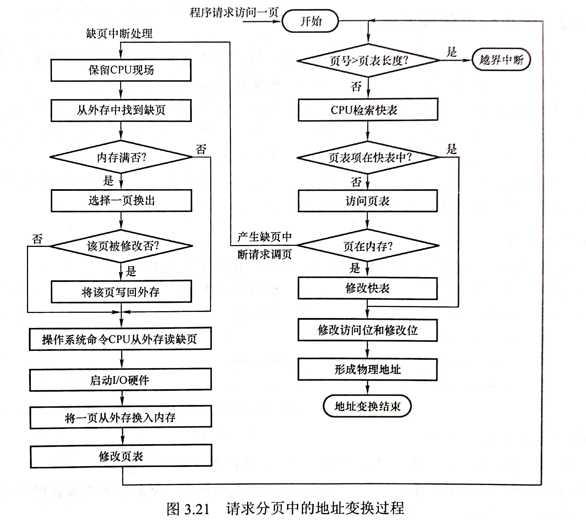

# 3.2 虚拟内存技术

## 3.2.1 虚拟内存的概念

### 1、传统存储管理方式的特征

1. **一次性**：作业必须一次性全部装入内存才能开始运行
   * 作业很大时，内存无法完全装入，导致作业无法运行
   * 大量作业运行时，内存无法容纳所有作业，导致多道程序并发性下降
2. **驻留性**：作业一旦进入内存，就会一直驻留在内存中，直到作业运行结束
   * 会导致暂时无用的大量数据驻留在内存中，导致内存的浪费

### 2、局部性原理

**时间局部性**：如果执行了程序中的某条指令，那么不久后这条指令很有可能再次执行；如果某个数据被访问过，不久之后该数据很可能再次被访问。\( 因为程序中存在大量的循环\)

**空间局部性**：一旦程序访问了某个存储单元，在不久之后，其附近的存储单元也很有可能被访问。 \(因为很多数据在内存中都是连续存放的，并且程序的指令也是顺序地在内存中存放的\)

### 3、虚拟存储器的定义和特征

基于**局部性原理**，

* 在程序装入时，可以将程序中很快会用到的部分装入内存，暂时用不到的部分留在外存， 就可以让程序开始执行。
* 在程序执行过程中，当所访问的信息不在内存时，由操作系统负贵将所需信息从外存调入内存，然后继续执行程序。
* 若内存空间不够，由操作系统负贵将内存中暂时用不到的信息换出到外存。 

在操作系统的管理下，在用户看来似乎有一个比实际内存大得多的内存，这就是**虚拟内存**。

#### 虚拟内存的主要特征

* **多次性**：无需在作业运行时一次性全部装入内存，而是允许被分成多次调入内存
* **对换性**：在作业运行时无需一直常驻内存，而是允许在作业运行过程中，将作业换入、换出
* **虚拟性**：从逻辑上扩充了内存的容量，使用户看到的内存容量，远大于实际的容量

### 3、虚拟内存技术的实现

虚拟内存技术，允许一个作业分多次调入内存。如果采用连续分配方式，会不方便实现。因此，虚拟内存的实现需要建立在**离散分配的内存管理方式**基础上。

* 请求分页存储管理
* 请求分段存储管理
* 请求段页式存储管理

## 3.2.2 请求分页管理方式

**请求调页功能**：将不在内存中的页面从外存调入内存

**页面置换功能**：将暂时用不到的页面调出到外存

### 1、页表结构

请求分页式的页表内容包括：

* 页号（隐含）
* 内存块号
* **状态位**：该页面是否已经调入内存
* **访问字段**：该页面在一段时间内的被访问次数，用于页面置换参考
* **修改位**：页面调入内存后是否被修改过
* **外存地址**：页面在外存中的存储位置

### 2、缺页中断机构

在请求分页系统中，每当要访问的页面不在内存时，便产生一个**缺页中断**，然后由操作系统的**缺页中断处理程序**处理中断。 

此时**缺页的进程阻塞**，放入阻塞队列，调页完成后再将其唤醒，放回就绪队列。

1. 如果内存中**有空闲块**，则为进程分配一个空闲块，将所缺页面装入该块，并修改页表中相应的页表项。
2. 如果内存中**没有空闲块**，则由页面置换算法选择一个页面淘汰，若该页面在内存期间被修改过，则要将其写回外存。未修改过的页面不用写回外存。


缺页中断属于内中断，属于故障中断（可以被故障处理程序修复）


###  3、地址变换机构

1. 只有**写指令**才需要修改**修改位**。并且，一般来说只需修改快表中的数据，只有要将快表项删除时才需要写回内存中的慢表。这样可以减少访存次数。
2. 和普通的中断处理一样，缺页中断处理依然需要保留CPU现场。 
3. 需要用某种页面置换算法来决定一个换出页面
4. 换入/换出页面都需要启动慢速的I/0操作，如果换入/ 换出太频繁，会有很大的开销。
5. 页面调入内存后，需要修改慢表，同时也需要将表项复制到快表中。

## 3.2.3 页面置换算法

### 1、最佳置换算法（OPT，Optimal）

每次选择淘汰的页面将是**以后永不使用**，或者**在最长时间内不再被访问的页面**，这样可以保证最低的缺页率。

最佳置换算法可以保证最低的缺页率，但实际运行中无法预知接下来访问页面的顺序，因此**最佳置换算法时无法实现的**。

### 2、先进先出置换算法（FIFO）

每次选择淘汰的页面是**最早进入内存的页面**。

**实现方法**：把调入内存的页面根据调入的先后顺序排成一个队列，需要换出页面时选择队头页面即可。 队列的最大长度取决于系统为进程分配了多少个内存块。


**Belady异常**：当为进程分配的物理块数增大时，缺页次数不减反增的异常现象。


**只有FIFO算法会产生belady异常**，且FIFO算法虽然实现简单，但是**算法性能差**。

### 3、最近最久未使用置换算法（LRU）

每次淘汰的页面是**最近最久未使用的页面**。

**实现方法**：赋予每个页面对应的页表项中，用访问字段记录该页面**自上次被访问以来所经历的时间t**。 当需要淘汰一个页面时，选择现有页面中t值最大的，即最近最久未使用的页面。

实现需要硬件支持，**性能较好，但开销较大**。

### 4、时钟置换算法（CLOCK）

时钟置换算法是一种性能和开销较均衡的算法，又称CLOCK算法，或最近未用算法（NRU, Not Recently Used）。

简单的CLOCK算法实现方法：

* 为每个页面设置一个访问位，再将内存中的页面都通过链接指针链接成 一个循环队列
* 当某页被访问时，其访问位置为1
* 当需要淘汰一个页面时，只需检查页的访问位
  * 如果是0，就选择该页换出
  * 如果是1，则将它置为0，暂不换出，继续检查下一个页面
* 若第一轮扫描中所有页面都是1，则将这些页面的访问位依次置为0后，再进行第二轮扫描
  * 第二轮扫描中一定会有访问位为0的页面，因此简单的CLOCK算法选择-一个淘汰页面最多会经过两轮扫描

#### 改进型的时钟算法

在原基础上，只有被淘汰的页面被修改过时，才需要写回外存。在其他条件都相同时，应**优先淘汰没有修改过的页面**，避免I/O操作。这就是改进型的时钟置换算法的思想。

**实现方法**：设置一个修改位，用于表示页面被修改过。0表示未被修改，1表示已修改。为方便讨论，用（访问位，修改位）的形式表示各页面状态。

* 第一轮：从当前位置开始扫描到第一个（0，0）的帧用于替换。本轮扫描不修改任何标志位
* 第二轮：若第一轮扫描失败，则重新扫描，查找第一个（0，1）的帧用于替换。本轮将所有扫描过的帧访问位设为0
* 第三轮：若第二轮扫描失败，则重新扫描，查找第一个（0，0）的帧用于替换。本轮扫描不修改任何标志位
* 第四轮：若第三轮扫描失败，则重新扫描，查找第一个（0，1）的帧用于替换。

