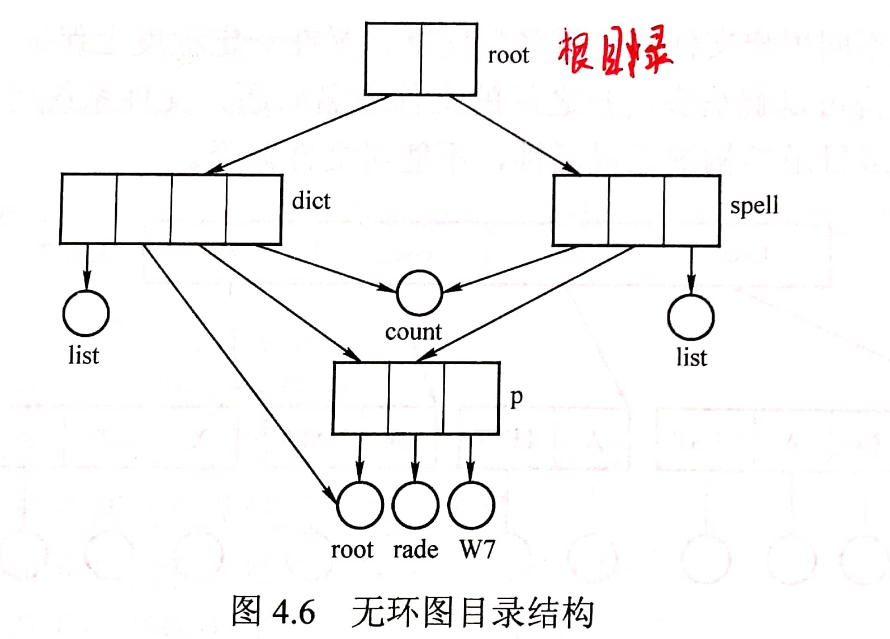

# 4.1 文件系统基础

## 4.1.1 文件的概念

### 1、文件的定义

一组有意义的信息的集合

### 2、文件的属性

**文件名**：由创建文件的用户决定，同一目录下不允许存在相同的文件名

**标识符**：系统内各文件的唯一标签，对于用户而言不可见

**类型**：文件的类型

**位置**：文件存放的路径（对用户而言）、在外存中的地址信息（对操作系统而言）

**保护信息**：对文件进行访问控制用的信息

**创建时间**、**修改时间**等。

### 3、操作系统提供的相关功能

- 创建文件（create系统调用）
- 删除文件（delete系统调用）
- 读文件（read系统调用）
- 写文件（write系统调用）
- 打开文件（open系统调用）
- 关闭文件（close系统调用）

**打开文件表**：存储文件的读写信息

每一位用户有一个自己的打开文件表

<table>
  <thead>
    <tr>
      <th style="text-align:center">&#x7F16;&#x53F7;</th>
      <th style="text-align:center">&#x6587;&#x4EF6;&#x540D;</th>
      <th style="text-align:center">&#x8BFB;&#x5199;&#x6307;&#x9488;</th>
      <th style="text-align:center">&#x8BBF;&#x95EE;&#x6743;&#x9650;</th>
      <th style="text-align:center">&#x7CFB;&#x7EDF;&#x8868;&#x7D22;&#x5F15;&#x53F7;</th>
    </tr>
  </thead>
  <tbody>
    <tr>
      <td style="text-align:center">&#x2026;&#x2026;</td>
      <td style="text-align:center">&#x2026;&#x2026;</td>
      <td style="text-align:center">
        
&#x8BFB;/&#x5199;&#x8FDB;&#x7A0B;&#x5BF9;&#x8BE5;

        
&#x6587;&#x4EF6;&#x7684;&#x8BFB;/&#x5199;&#x64CD;&#x4F5C;

        
&#x8FDB;&#x884C;&#x5230;&#x7684;&#x4F4D;&#x7F6E;

      </td>
      <td style="text-align:center">&#x53EA;&#x8BFB;/&#x8BFB;&#x5199;/..</td>
      <td style="text-align:center">
        
&#x6587;&#x4EF6;&#x5728;&#x7CFB;&#x7EDF;&#x7684;&#x6253;&#x5F00;

        
&#x6587;&#x4EF6;&#x8868;&#x4E2D;&#x7684;&#x7F16;&#x53F7;

      </td>
    </tr>
  </tbody>
</table>

此外，整个系统拥有一张系统打开文件表

<table>
  <thead>
    <tr>
      <th style="text-align:center">&#x7F16;&#x53F7;</th>
      <th style="text-align:center">&#x6587;&#x4EF6;&#x540D;</th>
      <th style="text-align:center">&#x2026;&#x2026;</th>
      <th style="text-align:center">&#x5916;&#x5B58;&#x5730;&#x5740;</th>
      <th style="text-align:center">&#x6253;&#x5F00;&#x8BA1;&#x6570;&#x5668;</th>
    </tr>
  </thead>
  <tbody>
    <tr>
      <td style="text-align:center">&#x2026;&#x2026;</td>
      <td style="text-align:center">&#x2026;&#x2026;</td>
      <td style="text-align:center">&#x2026;&#x2026;</td>
      <td style="text-align:center">&#x2026;&#x2026;</td>
      <td style="text-align:center">
        
&#x5F53;&#x524D;&#x6709;&#x591A;&#x5C11;&#x8FDB;&#x7A0B;

        
&#x6253;&#x5F00;&#x4E86;&#x6B64;&#x6587;&#x4EF6;

      </td>
    </tr>
  </tbody>
</table>

## 4.1.2 文件的逻辑结构

<mark style="color:purple;">**逻辑结构**</mark>：在<mark style="color:orange;">**用户**</mark>看来，文件内部的数据应该是如何组织起来的

<mark style="color:purple;">**物理结构**</mark>：在<mark style="color:orange;">**操作系统**</mark>看来，文件 的数据是如何存放在外存中的

### 1、无结构文件

文件内部的数据就是一系列二进制流或字符流组成。又称**流式文件**，如：Windows操作系统中的.txt文件、mp3文件等。

### 2、有结构文件

由一组相似的记录组成，又称**记录式文件**。每条记录又若干个数据项组成。如：数据库表文件，CSV文件等。一般来说，每条记录有一个数据项可作为**关键字**（作为识别不同记录的ID）。

根据每条记录的长度是否相等，可以分为**定长记录**和**可变长记录**两种。

有结构文件的**逻辑结构**可以分为以下三种：

#### （1）顺序文件

文件中的记录一个接一个地**顺序排列（逻辑上）**，记录可以是定长的或可变长的。

顺序文件可以有以下存储方式：

- 链式存储：（逻辑上相邻、物理上不相邻）无论是定长/可变长记录，都**只能依次查找**，无法实现随机存取
- 顺序存储：（逻辑上相邻、物理上也相邻）
  - 可变长记录：无法实现随机存储
  - 定长记录：可以实现随机存储。记录长度为L，则第i个记录的相对位置就是 i \* L
    - 若采用串结构；（记录之间的顺序与关键字无关，一般按照记录时间排序）无法快速找到对应关键字的记录
    - 若采用顺序结构：（记录之间按照关键字排列）可以迅速查找到相应关键字对应的记录


考试中一般提到顺序文件默认为**顺序存储的顺序文件**


**顺序文件实现增删改查较为困难**

#### （2）索引文件

索引表本身是定长记录的顺序文件。因此可以快速找到第i个记录对应的索引项。 

可将关键字作为索引号内容，若按关键字顺序排列，则还可以支持按照关键字折半查找。

每当要增加/删除一个记录时，需要对索引表进行修改。由于索引文件有很快的检索速度，因此**主要用于对信息处理的及时性要求比较高的场合**。

同时，可以对不同的数据项建立多个索引表，方便查找。

缺点：当记录数量增大时，索引表的大小也会变大，甚至可能出现索引表比文件本身还大的情况

索引文件是<mark style="color:orange;">**顺序存储**</mark>的，可以使用<mark style="color:purple;">**折半查找**</mark>。

#### （3）索引顺序文件

索引顺序文件是索引文件和顺序文件思想的结合。索引顺序文件中，同样会为文件建立一张索引表，但不同的是：并不是每个记录对应一个索引表项，而是**一组记录**对应**一个索引表项**。

即，将文件分为若干组顺序文件，查找时先通过索引表找到所在的顺序文件，再通过顺序检索找到相应的记录。

若有n个记录，则索引顺序文件**最好的分组**为：

- 分成$$\sqrt n$$组
- 每组$$\sqrt n$$条记录

索引顺序文件的索引表<mark style="color:orange;">**不是顺序存储**</mark>的，只能使用<mark style="color:purple;">**顺序查找**</mark>。

## 4.1.3 目录结构

### 1、文件控制块

文件控制块（FCB）：**FCB的有序集合称为文件目录**，一个FCB就是一个文件目录项

FCB中包含了文件的：

- 基本信息（文件名、物理地址、逻辑结构、物理结构等）
- 存取控制信息（是否可读/可写、禁止访问的用户名单等）
- 使用信息（如文件的建立时间、修改时间等）。

### 2、目录结构

用户需要对目录进行的操作：

- **搜索**：当用户要使用一个文件时，系统要根据文件名搜索目录，找到该文件对应的目录项
- **创建文件**：创建一个新文件时，需要在其所属的目录中增加一个目录项
- **删除文件**：当删除一个文件时，需要在目录中删除相应的目录项
- **显示目录**：用户可以请求显示目录的内容，如显示该目录中的所有文件及相应属性

目录有以下几种结构：

#### （1）单级目录结构

整个系统中只建立一张目录表，每个文件占一个目录项。

- 优点
  - 实现了按名存取
- 缺点
  - 不允许文件重名
  - 不适用于多用户操作系统

#### （2）两级目录结构

早期的多用户操作系统，采用两级目录结构。分为主文件目录（MFD，Master File Directory）和用户文件目录（UFD，User Flie Directory）。

主目录记录用户名和其用户文件目录存储的位置，用户目录记录用户文件的FCB信息。

- 优点
  - 允许不同用户的文件重名
  - 对多用户文件的访问限制
- 缺点
  - 缺乏灵活性，用户不能对文件进行分类

#### （3）多级目录结构

又称树形目录结构。用户要访问某个文件时要用**文件路径名**标识文件，文件路径名是个字符串。各级目录之间用“/”隔开。从根目录出发的路径称为**绝对路径**。

当目录层数较多时，每次都从根目录查找是很费时的，因此一般会设置**当前目录**。

当用户已经打开了某个目录，即这张目录表已调入内存，那么可以把它设置为当前目录。当用户想要访问某个文件时，可以使用从当前目录出发的**相对路径**。

- 优点
  - 便于对文件进行分类
  - 层次结构清晰
- 缺点
  - 不便于实现文件的共享

#### （4）无环图目录结构

在树形目录结构的基础上，增加些指向同一节点的有向边，使整个目录成为一个**有向无环图**。可以用不同的文件名指向同一个文件，甚至可以指向同一个目录（共享同一目录下的所有内容）。 

可以更方便地实现多个用户间的文件共享。

需要为每个共享结点设置一个**共享计数器**，用于记录此时有多少个地方在共享该结点。用户提出删除节点的请求时，只是删除该用户的FCB、并使共享计数器减1，**并不会直接删除共享结点**。当共享计数器的值为0时，才会删除该结点。

### 3、索引节点

由于在查找文件时只需要使用到文件名这一信息，因此可以将其他的文件信息放进**索引节点**中。这样目录中只需要存储**文件名和指向索引节点的指针**即可。

存放在外存中的索引结点称为**磁盘索引结点**，当索引结点放入内存后称为**内存索引结点**。 相比之下内存索引结点中需要增加一些信息，比如：文件是否被修改、此时有几个进程正在访问该文件等。

## 4.1.4 文件共享

### 1、基于索引节点的共享方式（硬链接）

在索引结点中设置一个链接计数变量count，用于表示链接到本索引结点上的用户目录项数。

当某个用户删除自己的该文件时，只是删除该用户目录项中指向索引节点的条目，并将索引节点中count减一。

### 2、基于符号链的共享方式（软链接）

系统创建一个LINK类型的文件，记录了它所指向的文件的路径，当操作系统访问时，通过该路径按级查找目录，得到该文件。

软连接的方式由于需要逐级访问目录，因此会比硬链接要慢。

## 4.1.5 文件保护

### 1、口令保护

为文件设置一个**口令**，用户请求访问该文件时必须提供口令。

口令一般存放在**文件对应的FCB或索引结点中**。用户访问文件前需要先输 入口令，操作系统会将用户提供 的口令与FCB中存储的口令进行对比， 如果正确，则允许该用户访问文件。

- 优点
  - 保存口令的开销不多
  - 验证口令的开销也很小
- 缺点
  - 口令存放在系统内部，不够安全

### 2、加密保护

使用某个密码对文件进行加密，在访问文件时需要提供正确的密码才能对文件进行正确的解密。

例如，使用异或运算，密码为01001，则对于文件的原始二进制位每5个一组依次与密码进行异或运算，得到密文，解码时，同样将密文依次异或运算，得到明文。

- 优点
  - 保密性强
- 缺点
  - 加密/解密需要一定的时间

### 3、访问控制

在每个文件的FCB（或索引结点）中增加一个**访问控制列表（Access-Control List，ACL）**该表中记录了各个用户可以对该文件执行哪些操作。

**精简的访问列表**：以**组**为单位，标记各用户组可以对文件执行哪些操作。解决了当系统用户过多时访问控制表过大的问题。

- 优点
  - 实现灵活，可以实现复杂的文件保护方式

