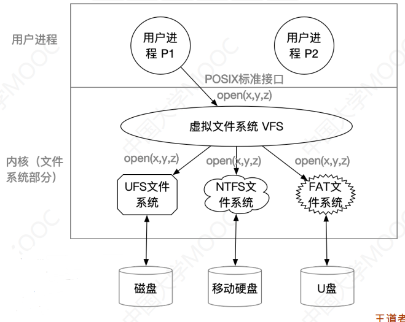
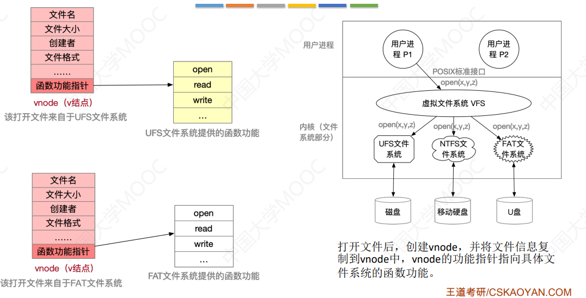

# 4.2 文件的系统实现

## 4.2.1 文件系统结构

## 4.2.2 文件系统布局

### 1、文件在磁盘中的结构

#### （1）文件系统的建立

1. 空白磁盘
2. **物理格式化**
   - 划分扇区
   - 检测坏扇区
   - 用备用扇区替换坏扇区
3. **逻辑格式化**
   - 磁盘分区
   - 建立主引导记录
   - 建立系统盘中的引导块、超级块、根目录等等

#### （2）文件系统中的特殊块

- **主引导记录**：位于0号扇区，用于找到引导块
- **引导块**：位于系统盘中，启动系统
- **超级块**：用于快速找到所有的空闲分区，系统启动时载入内存
- **空闲空间管理**：位示图等
- **i节点区**：索引节点，存放每个文件的索引节点
- **根目录**

### 2、文件在内存中的结构

- 目录的缓存
- 系统打开文件表
- 进程打开文件表

设要访问某路径上的文件，实际步骤如下：

1. 通过open指令根据路径逐级读入目录
2. 将目录M读入<mark style="color:purple;">**缓存**</mark>，开始寻找目标FCB
3. 找到FCB，复制进入<mark style="color:purple;">**系统打开文件表**</mark>，打开计数设1
4. 在<mark style="color:purple;">**进程打开文件表**</mark>中新建条目，指向相应的系统打开文件表

## 4.2.3 虚拟文件系统（VFS）

### 一、虚拟文件系统的特点

- 对用户提供统一的接口
- 要求下层文件系统实现某些特定的函数功能（read、write…）

- 在内存中创建vnode来存储来自不同文件系统的目录项信息
  - 每打开一个文件，就创建一个vnode
  - vnode中函数功能指针指向实现函数功能的位置

### 二、VFS所定义的对象类型

- 超级块对象
- 索引节点对象
- 目录对象
- 文件对象

### 三、文件系统挂载

1. 在VFS中注册新挂载的文件系统，在<mark style="color:purple;">**挂载表**</mark>中添加文件系统的相关信息
2. 向VFS提供函数地址列表
3. 将新的问价系统加到<mark style="color:purple;">**挂载点**</mark>

## 4.2.4 文件的物理结构


即文件分配方式，对应书4.2.3


**磁盘块**：类似于**内存分页**，磁盘中的存储单元也会被分为一个个**块/磁盘块/物理块**。很多操作系统中，**磁盘块的大小与内存块、页面的大小相同**。

**文件块**：在外存管理中为了方便对文件数据的管理，与内存管理相似的，**文件的逻辑地址空间**也被分为了一个一个的文件块。

文件的逻辑地址也可以表示为（_逻辑块号，块内地址_）的形式。

### 1、连续分配

连续分配方式要求每个文件在磁盘上占有**一组连续的块**。

在文件目录中记录存放的**起始块号**和**长度** 。因此只需要找到相应的FCB，即可找到对应的文件。

$$
物理块号 = 起始块号 + 逻辑块号(用户给出)
$$

* 优点
  * 支持顺序访问
  * 支持直接（随机）访问
  * 在顺序读/写时速度最快（磁道挨着，磁头移动距离最短）
* 缺点
  * 不方便文件的拓展
  * 存储空间利用率低，会产生磁盘碎片

### 2、链接分配

链接分配采取离散分配的方式，可以为文件分配离散的磁盘块。

<mark style="color:purple;">**记录成组分解技术**</mark>：存储时不可以跨越“块”存储记录

#### （1）隐式链接

目录中记录了文件存放的**起始块号**和**结束块号**。除了文件的最后一个磁盘块之外，每个磁盘块中都会保存指向下一个盘块的指针，这些指针对用户是透明的。同时，在文件目录中包含了第一块和最后一块的指针。

要访问某个磁盘块，需要顺序的访问它前面的所有磁盘块来指向它。

* 优点
  * 方便文件拓展
  * 不会产生碎片
* 缺点
  * 只支持顺序存储，不支持随机存储
  * 指向下一个磁盘块的指针会占用少量空间

#### （2）显式链接

把用于链接文件各物理块的指针**显式地**存放在一张表中。即文**件分配表**（FAT，File Allocation Table）。

FAT中存放了物理块号和这个物理块指向的下一个物理块号。一个磁盘仅设一张FAT，开机时读入并在之后常驻内存。其各个表项在物理上连续存储（即实际硬盘中的依次各物理块），表长相同，因此物理块号是隐含的。

* 优点
  * 方便文件拓展
  * 不会产生碎片
  * 支持随机存储
  * 地址转换不需要访问磁盘（FAT存储在内存中，查询不需要进行IO操作）
* 缺点
  * FAT需要占用一定的空间


题目中没有说则默认为隐式链接


### 3、索引分配

索引分配允许文件离散地分配在各个磁盘块中，系统会为**每个文件建立一张索引表**，索引表中记录了文 件的各个逻辑块对应的物理块（类似于内存管理中的页表，建立逻辑页面到物理页之间的映射关系\)。

索引表存放的磁盘块称为**索引块**。文件数据存放的磁盘块称为**数据块**。

访问时，先通过FCB找到文件的索引块地址，再根据逻辑地址查找索引块得到实际磁盘块。

* 优点
  * 支持随机存储
  * 易于拓展
* 缺点
  * 索引表占用一定的空间
  * 访问数据块前需要先读入索引块
  * 可能需要多次磁盘读取操作

当文件很大，索引表一个物理块装不下时，有三种处理方案：

#### （1）链接方案

如果索引表太大，一个索引块装不下，那么可以将多个索引块链接起来存放。FCB中只需要存放第一个索引块的地址即可。

要查找一个块，需要将前面的所有索引表都查找一遍，效率低下。

#### （2）多层索引

建立多层索引，使第一层索引块指向第二层的索引块。还可根据 文件大小的要求再建立第三层、第四层索引块。


例：假设磁盘块大小为1KB，一个索引表项占4B，则一个 磁盘块只能存放256个索引项。

若某文件采用两层索引，则该文件的最大长度可以到 

$$256 \times 256 \times 1 \text{KB} = 65536 \text{KB}  = 64 \text{MB}$$


**以两层为例**，访问地址时，先访问FCB找到顶级索引表，根据逻辑地址计算出二级索引表的块号，访问二级索引表，并查询得到物理块号，**共计三次IO访问**。

* 缺点
  * 即使是小文件，也需要经过K+1次读磁盘（K为索引层数）

#### （3）混合索引

多种索引分配方式的结合。例如，一个文件的顶级索引表中，既包含直接地址索引（直接指向数据块），又包含一级间接索引（指向单层索引表），还包含两级间接索引（指向两层索引表） 。

解决了小文件读磁盘次数过多的问题。


做题时注意条件中顶级索引块是否已经调入内存。


## 4.2.5 文件的存储空间管理

### 1、存储空间的划分与初始化

* 存储空间的划分：将物理磁盘划分为一个个文件卷（逻辑卷、逻辑盘）
* 存储空间的初始化：将各个文件卷划分为目录区、文件区
  * 目录区：存放FCB、用于磁盘空间管理的相关信息
  * 文件区：存放文件数据

### 2、存储空间的管理

文件存储设备的管理实质上就是对空闲块的组织和管理

#### （1）空闲表法

**如何分配磁盘块**：与内存管理中的动态分区分配很类似，为一个文件**分配连续的存储空间**。同样可采用首次适应、最佳适应、最坏适应等算法来决定要为文件分配哪个区间。

**如何回收磁盘块**：与内存管理中的动态分区分配很类似，考虑是否合并空闲分区的问题即可。

#### （2）空闲链表法

系统存储链头、链尾指针。

* **空闲盘块链**：以**盘块为单位**组成空闲链，每一个盘块中保存指向下一个盘块的指针
  * 如何分配：若某文件申请K个盘块，则从链头开始依次摘 下K个盘块分配，并修改空闲链的链头指针。
  * 如何回收：回收的盘块依次挂到链尾，并修改空闲链的链尾指针
  * 适用于离散的物理结构、分配时可能需要**多次重复**的操作
* **空闲盘区链**：**以盘区（连续的空闲盘块）为单位**组成空闲链，第一个盘块中保存盘区长度、下一个盘区的指针
  * 如何分配：
    * 若某文件申请K个盘块，则可以采用首次适应、最佳适应等算法，从链头开始检索， 按照算法规则找到一个大小符合要求的空闲盘区， 分配给文件
    * 若没有合适的连续空闲块，也可以将不同盘区的盘块同时分配给一个文件， 注意分配后可能要修改相应的链指针、盘区大小等数据
  * 如何回收：
    * 若回收区和某个空闲盘区相邻，则需要将回收区合并到空闲盘区中
    * 若回收区没有和任何空闲区相邻，将回收区作为单独的盘区挂到链尾
  * 离散分配、连续分配均适用，且分配多个盘块时效率更高

#### （3）位示图法

每个二进制位对应一个盘块，如0代表盘块空闲，1代表盘块已分配。

位示图一般用连续的字来表示，如一 个字的字长是16位，字中的每一位对应一个盘块。因此可以用（字号，位号）对应一个盘块号。当然有的题目中也描述为（行号，列号）

设字长为n，盘块号为b，字号为i，位号为j，则有：

$$
b = n \times i + j\\
i = b/n;\\  j = b \% n
$$

**如何分配**：

* 若文件需要K个块
  1. 顺序扫描位示图，找到K个相邻或不相邻 的0
  2. 根据字号、位号算出对应的盘块号，将相应盘块分配给文件
  3. 将相应位设置为1

**如何回收**：

1. 根据回收的盘块号计算出对应的字号、位号
2. 将相应位置的二进制位设为0

#### （4）成组链接法

文件卷的目录区中专门用一个磁盘块作为**超级块**，当系统启动时需要**将超级块读入内存**。并且要保证内存与外存中的超级块数据一致。将空闲块进行分组，如100个一组。

在超级块中，记录了下一个分组的空闲盘块的盘块数和这一组盘块的盘块号。

在每一组的第一个盘块中记录下一组空闲盘块的开始的盘块号。若是最后一组，则记为某个特殊值如-1。

盘块的分组有数量限制，且最后一组的数量上限会少一块（用于标记特殊值）。

**如何分配**：

1. 检查下一个分组中空闲块是否足够
2. 分配空闲块，并修改空闲块数
3. 若需要将整租空闲块都分配出去，需要先将第一块的内容复制到超级块中。

**如何回收**：

* 若第一个分组没有满，则将该空闲块插入第一组中，修改相应信息；
* 若分组已满，需要将超级块中的数据复制到新回收的块中，并修改超级块的内容，**让新回收的块成为第一个分组**。

