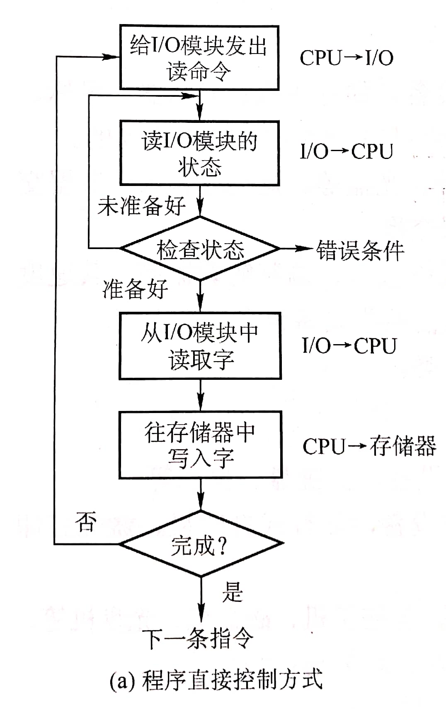
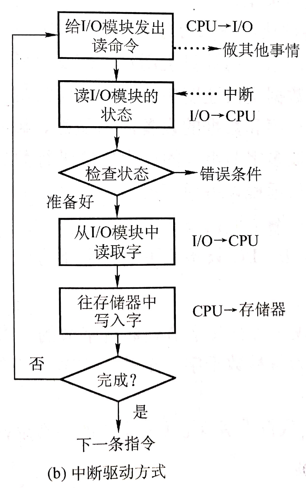
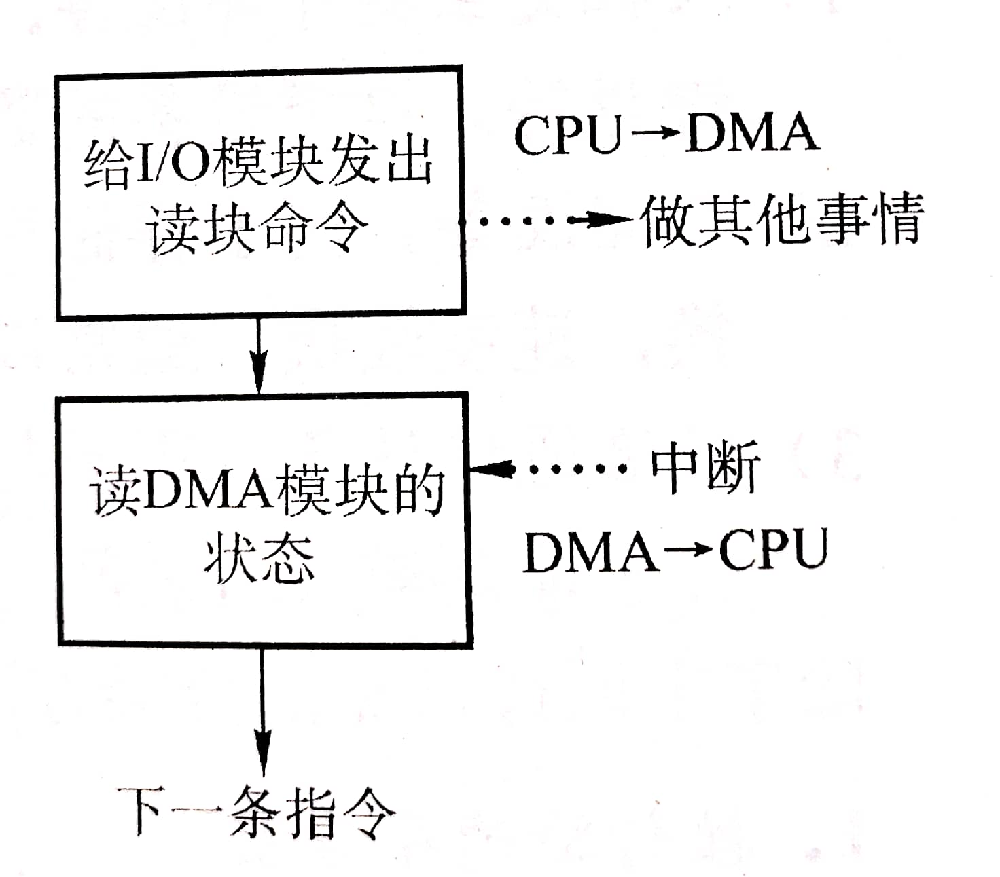

# 5.1 I/O管理概述

## 5.1.1 I/O设备

I/O设备就是可以将数据输入或者可以接收计算机输出数据的外部设备，属于计算机中的硬件部件。

按照**使用特征**，I/O设备可以分为以下几类：

* 人机交互设备
* 存储设备
* 网络通信设备

按照**传输速度**，I/O设备可以分为以下几类：

* 低速设备：键盘鼠标等
* 中速设备：打印机等
* 高速设备：硬盘等

按照**信息交互的单位**，I/O设备可以分为以下几类：

* 块设备
  * 以数据块为单位进行信息交互
  * 读取速度快
  * 可寻址（可以随机的读写任意一块）
* 字符设备
  * 传输的基本单位是字符
  * 读取速度慢
  * 不可寻址
  * 输入输出采用中断驱动方式

## 5.1.2 I/O子系统的层次结构

### 1、I/O设备的电子部件（I/O控制器）

I/O设备的机械部分就是具体的执行机构，例如键盘的机械轴、硬盘的磁头、盘片等。

CPU无法直接控制I/O设备的机械部件，因此I/O设备还要有一个电子部件用于实现CPU对设备的控制。 这个电子部件就是**I/O控制器**，又称**设备控制器**。CPU可控制I/O控制器，又由I/O控制器来控制设备的机械部件。

#### （1）I/O控制器的功能

* 接收和识别CPU发出的命令
  * 通过I/O控制器中的**控制寄存器**来存放相应指令和参数
* 向CPU报告设备的状态
  * 通过I/O控制器中的**状态寄存器**记录当前I/O设备的状态
* 数据交换
  * 通过I/O控制器中的**数据寄存器**暂存准备传入或传出的数据
* 地址识别

#### （2）I/O控制器的组成

* CPU与控制器的接口（图中左半部分整体）
  * CPU通过控制线发出命令
  * 通过地址线指明要操作的设备
  * 通过数据线存/取数据
* I/O逻辑
  * 接收和识别CPU发来的各种指令
  * 对设备发出指令
* 控制器与设备的接口
  * 用于实现控制器与设备之间的通道
  * 数据线传输数据
  * 状态线向控制器反馈当前设备状态
  * 控制器通过控制线向相应的设备发送控制信号


1. 由于一个I/O控制器可能连接多个I/O设备，因此数据寄存器、状态寄存器、控制寄存器的数量也可能会有多个（一个设备对应一个）
2. 这些寄存器都需要有相应的地址以便CPU寻址操作。其中
   * 有的计算机会让这些寄存器占用内存地址的一部分，称为**内存映像I/O**
     * 控制器中断寄存器与内存地址统一管理
     * 简化了指令，可以采用操作内存的指令来操作控制器 ✔
   * 另一些计算机则采用I/O专用地址，即**寄存器独立编址**
     * 控制器中的寄存器使用单独的地址
     * 需要设置专门的指令来操作控制器 ❌
     * 不仅需要指明寄存器地址，还要指明控制器编号 ❌


### 2、I/O软件层次结构

* 越上面的层次越接近用户；越下面的层次越接近硬件
* 每一层利用其下层提供的服务，实现某些功能，封装后再向上一级提供服务

* 用户层软件
  * 提供了与用户交互的接口，用户可以直接使用该层提供的**库函数**对I/O设备进行操作
  * 将用户的请求进行翻译，通过**系统调用**请求操作系统内核的服务
* 设备独立性软件（设备无关软件）
  * 向上层提供调用接口
  * 对设备的保护，与对文件的保护类似
  * 差错处理
  * 设备的分配与回收
  * 数据缓冲区管理
  * 建立逻辑设备名与物理设备名之间的映射关系，并选择调用相应的驱动程序
    * 通过**逻辑设备表（LUT）**实现
    * 可以整个系统一张LUT，也可以每个用户一张LUT（类似两级目录）
* 设备驱动程序
  * 负责对硬件设备的具体控制
  * 设置设备寄存器、检查设备状态等
* 中断处理程序
  * 当I/O任务完成时，I/O控制器会发出**中断信号**，系统会根据此信号找到相应的**中断处理程序**并执行

## 5.1.3 I/O控制方式

### 1、程序直接控制方式

#### （1）完成一次读/写操作的流程

1. CPU向I/O控制器发出命令
2. I/O控制器检查设备状态，并返回给CPU
3. 若设备可用，且无报错，则将要读/写的数据在CPU和数据寄存器之间完成转存
4. 完成读/写操作
5. 检查读/写操作是否完成，未完成则继续

核心思想：**轮询**

#### （2）CPU干预的频率

非常频繁。操作开始前、完成后、中间等待过程中均需要CPU不断地轮询检查。

#### （3）数据传输的单位

每次读/写**一个字**

#### （4）数据的流向

* 读操作
  * I/O设备 → CPU → 内存
* 写操作
  * 内存 → CPU → I/O设备

每个字的读写都需要CPU的协助

#### （5）优缺点

* 优点
  * 实现简单
* 缺点
  * CPU和I/O设备只能串行工作
  * CPU一直执行轮询操作，处于**忙等**状态

### 2、中断驱动方式

#### （1）完成一次读/写操作的流程

1. 由于I/O设备速度很慢，因此在CPU发出读/写命令后，可**将等待I/O的进程阻塞**，先切换到别的进程执行
2. 当I/O操作完成后，控制器会向CPU发出一个**中断信号**，CPU检测到中断信 号后，会**保存当前进程的运行环境信息**，转去执行中断处理程序处理该中断
3. 处理中断的过程中，CPU从I/O控制器读一个字的数据传送到CPU寄存器，再写入主存。
4. 接着，CPU恢复等待I/O的进程（或其他进程）的运行环境，然后继续执行

#### （2）CPU干预的频率

操作开始前、完成后需要CPU介入。

中间等待过程中CPU可以切换到别的进程运行。

#### （3）数据传输的单位

每次读/写**一个字**

#### （4）数据的流向

* 读操作
  * I/O设备 → CPU → 内存
* 写操作
  * 内存 → CPU → I/O设备

#### （5）优缺点

* 优点
  * 相对于程序直接控制方式，CPU利用率明显提升
  * CPU和I/O设备可以并行的工作
* 缺点
  * 每个字在I/O设备和内存之间的传输都需要经过CPU，频繁的中断会造成较大的开销

### 3、DMA（直接存储器存取）

与上两种相比，DMA方式：

* 数据的传送单位是**块**，不再是一个字一个字的传送
* 数据的流向是**从设备直接放入内存，或者从内存直接到设备**。不再需要CPU作为中转
* 仅在传送一个或多个数据块的开始和结束时，才需要CPU干预

**DMA控制器实际上也是一种I/O控制器**，相较于普通的I/O控制器，DMA设有以下四种寄存器：

* **DR（数据寄存器）**：暂存从设备到内存，或从内存到设备的数据
* **MAR（内存地址寄存器）**
  * 在输入时，MAR表示数据应放到内存中的什么位置
  * 输出时MAR表示要输出的数据放在内存中的什么位置
* **DC（数据计数器）**：表示剩余要读/写的字节数
* **CR（命令/状态寄存器）**：存放CPU发来的指令或是设备的状态信息

（1）完成一次读/写操作的流程

#### （2）CPU干预的频率

在传输一个（或多个）数据块开始和结束时才需要CPU干预

#### （3）数据传输的单位

每次读/写**一个（或多个）块**

每次读/写的块必须是**连续的块**，且在其存入内存后也必须是连续的。

#### （4）数据的流向

* 读操作
  * I/O设备 → 内存
* 写操作
  * 内存 → I/O设备

#### （5）优缺点

* 优点
  * 数据传输以块为单位
  * CPU介入频率降低，数据传输效率更高
  * CPU和I/O设备并行性提高
* 缺点
  * 当读/写多个离散的数据块、或者将数据写进不同的内存区域时，需要发出多次I/O指令，进行多次中断才能完成

### 4、通道控制方式

**通道**：一种硬件，可以理解为是“弱化版的CPU”。通道可以识别并执行一系列**通道指令**。

#### （1）完成一次读/写操作的流程

1. CPU向通道发出I/O指令
   * 指明通道程序在内存中的位置
   * 指明要操作的是哪个I/O设备
   * 之后CPU切换到其他进程执行
2. 通道执行内存中的通道程序
   * 要读入/读出多少数据
   * 读/写的数据应存放在内存中的什么地址
3. 通道执行完任务后发出中断信号，CPU处理中断信号

#### （2）CPU干预的频率

在传输一个（或多个）数据块开始和结束时才需要CPU干预

#### （3）数据传输的单位

每次读/写**一个（或多个）块**

每次读/写的块必须是**连续的块**，且在其存入内存后也必须是连续的。

#### （4）数据的流向

* 读操作
  * I/O设备 → 内存
* 写操作
  * 内存 → I/O设备

#### （5）优缺点

* 优点
  * I/O设备、通道、CPU可以并行的工作
  * 资源利用率很高
* 缺点
  * 实现复杂
  * 需要专门的通道硬件支持

