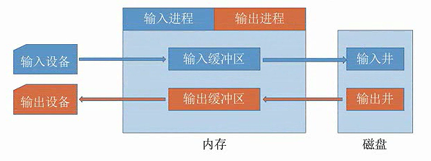
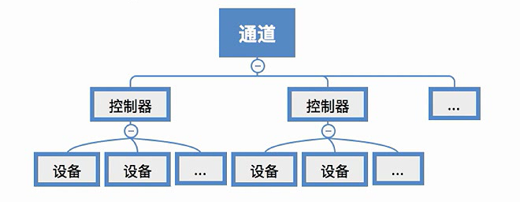

# 5.2 I/O核心子系统

## 5.2.1 I/O调度

用某个算法来确定满足I/O请求的顺序。例如FCFS、SCAN、C-LOOK等等。

与之前的调度算法别无二致。

## 5.2.2 I/O保护

由于在UNIX系统中，设备一般是看作一种特殊的文件，因此对于设备的保护与对文件的保护一致，通过在FCB中记录相关的访问权限信息来进行设备访问保护。

## 5.2.3 假脱机技术

**脱机技术**：**脱离主机的控制进行的输入/输出操作**。

利用磁带实现的脱机技术：在输入输出时，使用专门的输入输出设备从磁带中读/写信息。之后再由CPU高速的从磁带中读/写数据。

**假脱机技术**：又称**SPOOLing技术**，用软件的方式模拟脱机技术。SPOOLing系统的组成如下

在磁盘上专门开辟出两个存储区域：**输入井**和**输出井**。

* 输入井
  * 模拟脱机输入时的磁带
  * 用于收容I/O设备输入的数据
* 输出井
  * 模拟脱机输出时的磁带
  * 用于收容用户进程输出的数据
* 输入缓冲区
  * 在输入进程的控制下，用于暂存从输入设备输入的信息
  * 之后再转入到输入井中
* 输出缓冲区
  * 在输出进程的控制下，用于暂存从输出井传来的数据
  * 之后再传入输出设备上


假脱机技术虽然位于用户层软件，但是考纲中将其归类在了核心子系统的内容中


## 5.2.4 设备的分配与回收

## 1、设备分配时应考虑的因素

#### （1）设备的固有属性

* **独占设备**：一个时段只能分配给一个进程（如打印机）
* **共享设备**：可同时分配给多个进程使用（如磁盘）
  * 各进程往往是宏观上同时共享使用设备，而微观.上交替使用
* **虚拟设备**：采用SPOOLing技术将独占设备改造成虚拟的共享设备，可同时分配给多个进程使用（如采用SPOOLing技术实现的共享打印机）

#### （2）设备分配算法

* 先来先服务
* 优先级高者优先
* ……

#### （3）设备分配中的安全性

* 安全分配方式：为进程分配一个设备后就将进程阻塞，本次I/O完成后才将进程唤醒
  * 优点：破坏了“请求和保持”条件，不会造成死锁
  * 缺点：对于一个进程来说，CPU和I/O只能串行工作
* 不安全分配方式：进程发出I/O请求后，系统为其分配I/O设备，进程可继续执行，之后还可以发出新I/O请求。**只有某个/0请求得不到满足时才将进程阻塞**。
  * 优点：效率高，进程和I/O任务可以并行的执行
  * 缺点：有可能发生死锁

### 2、设备分配方式

* 静态分配：进程运行前为其分配全部所需资源，运行结束后归还资源
  * 破坏了“请求和保持”条件，不会发生死锁
* 动态分配：进程运行过程中动态申请设备资源

### 3、设备分配管理中的数据结构

* **设备控制表（DCT）**：每个设备一张，用于记录设备情况
  * 设备类型
  * 设备标识符
  * 设备状态
  * 指向控制器表的指针：指明设备所属的控制器
  * 重复执行次数或时间：只有多少次I/O操作失败后才判断失败
  * 设备队列的队首指针：指向当前设备的等待进程队列（由PCB组成）
* **控制器控制表（COCT）**：每个控制器一张，操作系统跟具COCT对控制器进行操作和管理
  * 控制器标识符
  * 控制器状态
  * 指向通道表的指针：指明控制器所属的通道
  * 控制器队列的队首指针：指向正在等待控制器的进程队列
  * 控制器队列的队尾指针
* **通道控制表（CHCT）**：每个通道一张，操作系统根据CHCT对通道进行操作和管理
  * 通道标识符
  * 通道状态
  * 与通道连接的控制器表首址：可通过该指针找到该通道管理的所有控制器相关信息
  * 通道队列的队首指针
  * 通道队列的队尾指针
* 系统设备表（SDT）：记录了系统中全部设备的情况，每个设备对应一个表目
  * 每一个表目记录设备的相关信息
    * 设备类型
    * 设备标识符
    * DCT（设备控制表）
    * 驱动程序入口

### 4、设备分配的步骤

1. 根据进程请求的物理设备名查找SDT
2. 根据SDT找到DCT
   * 若设备忙碌则将进程PCB挂到设备等待队列中
   * 不忙碌则将设备分配给进程
3. 根据DCT找到COCT
   * 若控制器忙碌则将进程PCB挂到控制器等待队列中
   * 不忙碌则将控制器分配给进程
4. 根据COCT找到CHCT
   * 若通道忙碌则将进程PCB挂到通道等待队列中
   * 不忙碌则将通道分配给进 程。

#### 缺点

用户必须使用物理设备名来请求设备，这导致了

* 若换了一个物理设备，则程序无法运行
* 若进程请求的物理设备正在忙碌，则即使系统中还有同类型的设备，进程也必须阻塞等待这特定的一个

#### 解决方式

建立**逻辑设备名**与物理设备名的映射表。

用户在请求设备时只需要提供逻辑设备名（即设备类型），系统会查找符合条件且空闲的设备分配给进程。

## 5.2.5 缓冲区管理

缓冲区是一个存储区域，可以由专门的硬件寄存器组成，也可利用内存作为缓冲区。

使用硬件作为缓冲区的成本较高，容量也较小，一般仅用在对速度要求非常高的场合（如存储器管理中所用的**联想寄存器**）

一般情况下，更多的是**利用内存作为缓冲区**，**设备独立性软件**的缓冲区管理就是要组织管理好这些缓冲区。

### 1、缓冲区的作用

* 缓和CPU与I/O设备之间速度不匹配的矛盾
* 减少对CPU的中断频率，放宽对CPU中断相应时间的限制
* 解决数据粒度不匹配的问题（输出进程每次输出一块，I/O每次只能输出一个字）
* 提高CPU与I/O设备之间的并行性

### 2、缓冲策略

（1）单缓冲

