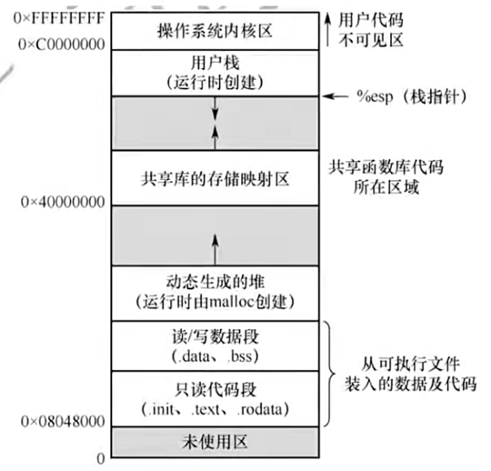

# 1.3 操作系统的运行环境

## 一、操作系统的运行机制

### 1、内核态和用户态

在计算机中存在两种程序，系统外层的**应用程序**和**内核程序**。

CPU在设计时存在**特权指令**与**非特权指令**，特权指令例如内存指令等。

实际上，CPU存在“**内核态**”与“**用户态**”两种状态。

* 内核态：此时运行的是**内核程序**，可以执行特权指令
* 用户态：此时运行的是**应用程序**，只能执行非特权指令


CPU中存在一个**程序状态字寄存器**（PSW），其二进制位1表示“内核态”，0表示“用户态”。

另外，内核态也叫做“核心态”或“管态”，用户态也叫做“目态”。

由用户态切换到内核态的操作称为“**访管**”，相应引发的中断称为“**访管中断**”



内核是操作系统最重要最核心的部分，许多的内核程序组成了操作系统内核。

### 2、内核态和用户态的转换

**内核态→用户态**：执行一条特权指令——修改PSW的标志位为“用户态”，这个动作意味着操作系统将主动让出CPU使用权 。

**用户态→内核态**：由“中断”引发，**硬件自动完成变态过程**，触发中断信号意味着操作系统将强行夺回CPU的使用权。

## 二、中断和异常

### 1、中断的作用

中断使CPU从用户态变为内核态。


中断是让操作系统内核夺回CPU控制权的唯一途径。


### 2、中断的类型

#### 内中断（异常）

中断信号与当前执行的指令**有关**，中断信号来源于CPU**内部**，一般与CPU和主存相关。

当前指令是非法的或是存在非法参数等会引发内中断。


当应用程序请求操作系统内核服务时，会引发一条**陷入指令**，该指令也会引发一个内中断信号。“系统调用”就是通过陷入指令完成的。

**陷入指令不是内核指令！**


异常的具体类型可以分为陷入（trap）、故障（fault）和中止（abort）。其中：

* trap：由陷入指令引发的；
* fault：由错误条件引起的，内核程序可以进行修复，修复故障后会将CPU使用权还给应用程序。例如缺页故障；
* abort：致命的、无法修复的错误。一般会直接终止应用程序，例如非法特权指令、空指针等。

#### 外中断

与当前执行的指令**无关**，中断信号来源于CPU**外部**。

例如时钟中断、I/O设备中断等。

### 3、中断机制的基本实现原理


**不同的中断信号，需要用不同的中断处理程序来处理**。当CPU检测到中断信号后，会根据中断信号的类型去查询“**中断向量表**”，以此来找到相应的中断处理程序在内存中的存放位置。


显然，中断处理程序是内核程序。

## 三、系统调用

系统调用指的是用户在应用程序中调用操作系统所提供的一些子功能。


应用程序通过**系统调用**请求操作系统的服务。而系统中的各种共享资源都由操作系统内核统一掌管， 因此**凡是与共享资源有关的操作\(如存储分配、I/0操作、文件管理等\)，都必须通过系统调用的方式向操作系统内核提出服务请求**，由操作系统内核代为完成。这样可以**保证系统的稳定性和安全性**，防止用户进行非法操作。


系统调用涉及的功能：

- 设备管理
- 文件管理
- 进程控制
- 进程通信
- 内存管理

系统调用的过程可以如下表所示：

| CPU状态 | 具体操作 |
| :---: | :--- |
| 用户态 | ①、传递系统调用参数 |
| 用户态 | ②、执行陷入指令 |
| 内核态 | ③、内核程序处理系统调用 |
| 用户态 | ④、继续执行应用程序 |


发出系统调用请求是在用户态，而对系统调用的相应处理在核心态下进行。


## 四、程序运行时的内存映像

当一个程序调入内存运行时就构成了进程的内存映像，一个进程的内存映像一般有几个 要素:

- **代码段**：即程序的二进制代码，代码段是只读的，可以被多个进程共享
- **数据段**：即程序运行时加工处理对象，包括全局变量和静态变量
- **进程控制块**（PCB）：存放在系统区。操作系统通过PCB来控制和管理进程
- **堆**：用来存放动态分配的变量（使用malloc分配的）
- **栈**：函数调用，实参传递，局部变量

