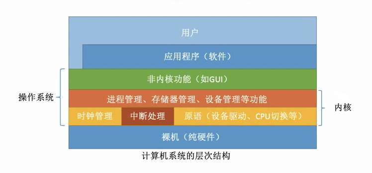

# 1.4 操作系统的体系结构

## 1.4.1 架构

### 1、分层式架构

将操作系统划分为若干层，层与层之间**单向依赖**

- **优点**
  - 便于系统的调试和验证
  - 易于扩充和维护
- **缺点**
  - 合理定义各层较为困难
  - 效率较差，执行一个指令需要自上而下穿越多层

### 2、模块化架构

将操作系统分为多个具有独立性的子模块，规定好模块之间的接口使得模块之间可以相互通信

- **独立性**：模块的独立性越高，各模块之间的交互越少，系统结构越清晰
- **衡量独立性的指标**
  - **内聚性**：模块内部联系的紧密程度，内聚性越高，独立性越好
  - **耦合度**：模块间相互联系与影响的程度，耦合度越低，独立性越好
- **优点**
  - 提高了操作系统设计的正确性，可理解性和可维护性
  - 增强了操作系统的可适应性
  - 加速了操作系统的开发过程
- **缺点**
  - 模块间的接口规定很难满足实际需求
  - 各模块设计者齐头并进，没有可靠的决定顺序

## 1.4.2 内核

一般来说，底层的时钟管理、中断处理、原语等与硬件关系紧密；而上层的进程管理、存储器管理、设备管理等处理数据结构等相关，与硬件关系不大。


转变CPU状态的过程是有成本的，要消耗不少时间，频繁地转变CPU状态会降低系统性能


### 1、大内核

这两层都在内核态下运行

* 优点
  * 性能高
* 缺点
  * 代码庞大
  * 结构混乱

### 2、微内核

只有底层保留在内核态下运行，运行时不断切换CPU状态

* 优点
  * 扩展性和灵活性
  * 可靠性和安全性
  * 可移植性
  * 分布式计算
* 缺点
  * 需要频繁的切换CPU状态，性能低

## 1.4.3 操作系统引导

1. 激活CPU
2. 读取ROM中的boot指令，开始执行BIOS程序
3. 硬件自检
4. 加载带有操作系统的硬盘，将引导扇区的内容加载进内存
5. 加载主引导记录MBR
6. 扫描硬盘分区表，并加载硬盘活动分区
7. 加载分区引导记录PBR：活动分区的第一个扇区，用于寻找根目录下的引导程序（启动管理器）
8. 加载启动管理器
9. 加载操作系统
